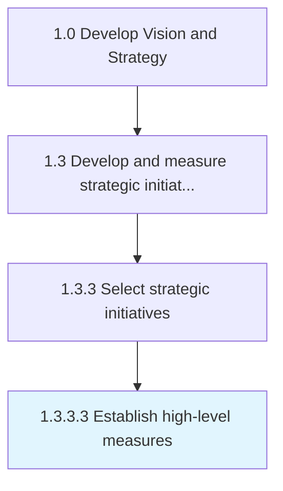

# Establish high-level measures

> Devising measures to examine strategic projects.

## Overview

Activity 1.3.3.3 is an activity within the Develop Vision and Strategy framework. 

Devising measures to examine strategic projects. Formulate evaluation criteria to assess the strategic initiatives for the level of impact.

## Process Hierarchy



## Key Statistics

| Metric | Value |
|--------|-------|
| APQC Code | 10060 |
| Hierarchy ID | 1.3.3.3 |
| Level | Activity |
| Parent | [1.3.3](../) |
| Sub-Processes | 0 |


## GraphDL Semantic Structure

```
establish.HighlevelMeasures
```

| Component | Value | Description |
|-----------|-------|-------------|
| Verb | `establish` | Primary action |
| Object | `high-level measures` | Direct object |


---

*Source: APQC PCF 10060 (1.3.3.3) - APQC*
