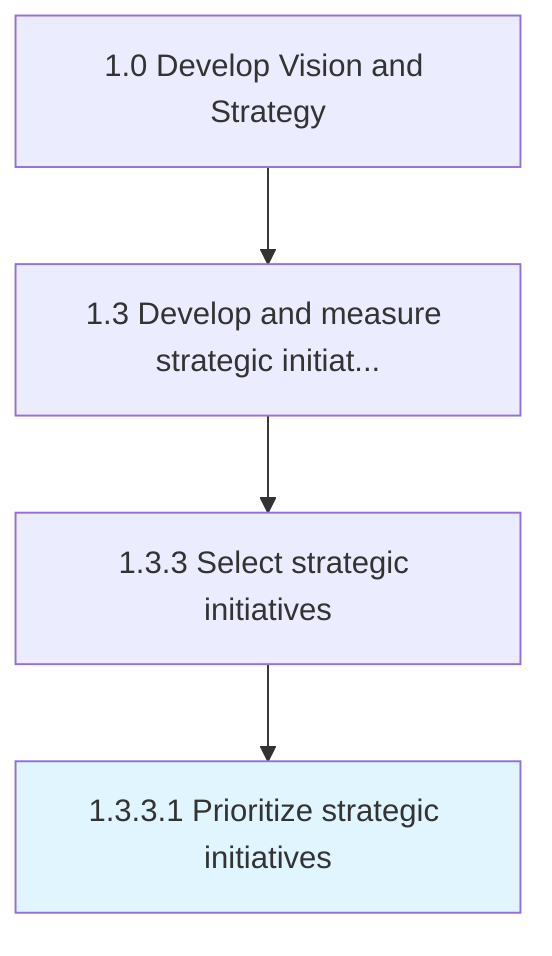

# Prioritize strategic initiatives

> Listing the most effective procedures in the order of most important to the least.

## Overview

Activity 1.3.3.1 is an activity within the Develop Vision and Strategy framework. 

Listing the most effective procedures in the order of most important to the least. Create measures or filter for determining which of many "strategic initiatives" is most important to the least important.

## Process Hierarchy



## Key Statistics

| Metric | Value |
|--------|-------|
| APQC Code | 19980 |
| Hierarchy ID | 1.3.3.1 |
| Level | Activity |
| Parent | [1.3.3](../) |
| Sub-Processes | 0 |


## GraphDL Semantic Structure

```
prioritize.StrategicInitiatives
```

| Component | Value | Description |
|-----------|-------|-------------|
| Verb | `prioritize` | Primary action |
| Object | `strategic initiatives` | Direct object |


## Related Concepts

- [StrategicInitiatives](/concepts/StrategicInitiatives)


---

*Source: APQC PCF 19980 (1.3.3.1) - APQC*
