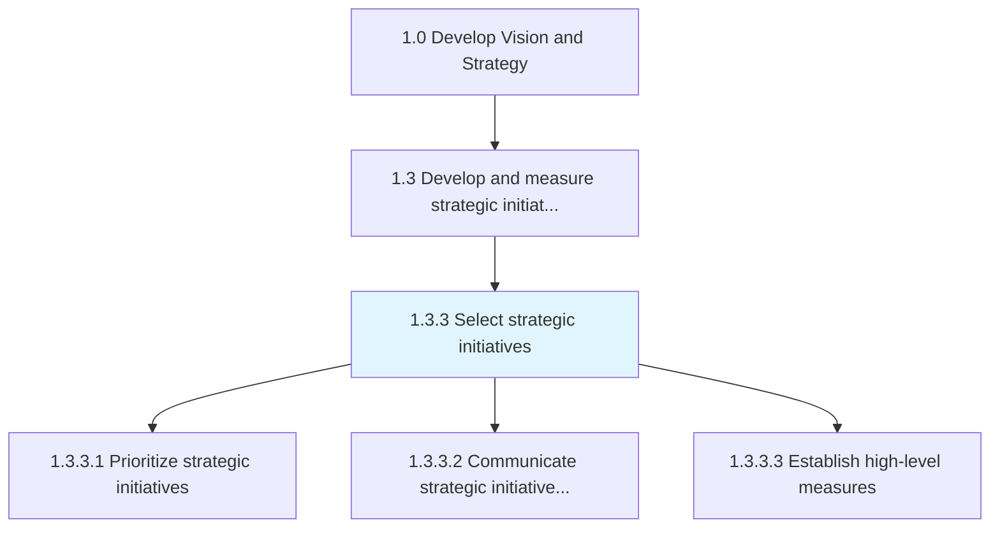
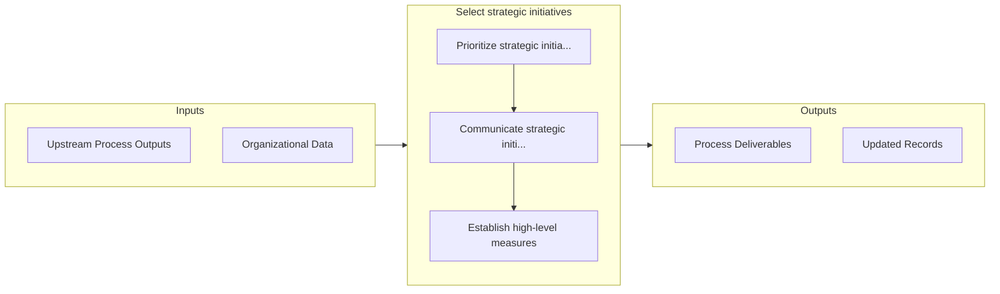

# Select strategic initiatives

> Selecting relevant projects of strategic significance that create opportunities for the organization to realize its long-term objectives, on the basis of their suitability to the organization's constraints and reality.

## Overview

Process 1.3.3 is a core process that defines the specific procedures for select strategic initiatives. 

Selecting relevant projects of strategic significance that create opportunities for the organization to realize its long-term objectives, on the basis of their suitability to the organization's constraints and reality. Select from the process Evaluate strategic initiatives [10058], based on their applicability and feasibility for the organization. Enlist senior management, especially strategy personnel.

## Process Hierarchy



## Key Statistics

| Metric | Value |
|--------|-------|
| APQC Code | 10059 |
| Hierarchy ID | 1.3.3 |
| Level | Process |
| Parent | [1.3](../) |
| Sub-Processes | 3 |


## GraphDL Semantic Structure

```
select.StrategicInitiatives
```

| Component | Value | Description |
|-----------|-------|-------------|
| Verb | `select` | Primary action |
| Object | `strategic initiatives` | Direct object |


## Process Flow



## Sub-Processes

| Process | Hierarchy ID | Description |
|---------|-------------|-------------|
| [Prioritize strategic initiatives](./PrioritizeStrategicInitiatives) | 1.3.3.1 | Listing the most effective procedures in the order of most important to the least |
| [Communicate strategic initiatives to business units and stakeholders](./CommunicateStrategicInitiativesToBusinessUnitsAndStakeholders) | 1.3.3.2 | Establishing procedures for communications within the organization which creates the road map for su |
| [Establish high-level measures](./EstablishHighlevelMeasures) | 1.3.3.3 | Devising measures to examine strategic projects |


## Related Concepts

- StrategicInitiatives


---

*Source: APQC PCF 10059 (1.3.3) - APQC*
