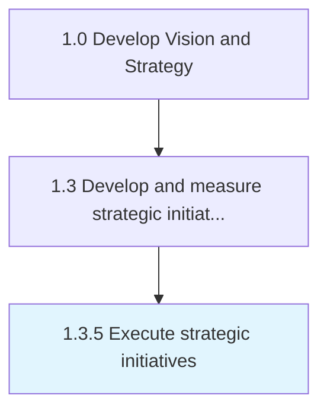

# Execute strategic initiatives

> Successfully implement strategic initiatives.

## Overview

Process 1.3.5 is a core process that defines the specific procedures for execute strategic initiatives. 

Successfully implement strategic initiatives. Execution of strategy is also defined as the process of implementing logical set of connected activities by an organization to make a strategy work.

## Process Hierarchy



## Key Statistics

| Metric | Value |
|--------|-------|
| APQC Code | 19507 |
| Hierarchy ID | 1.3.5 |
| Level | Process |
| Parent | [1.3](../) |
| Sub-Processes | 0 |


## GraphDL Semantic Structure

```
execute.StrategicInitiatives
```

| Component | Value | Description |
|-----------|-------|-------------|
| Verb | `execute` | Primary action |
| Object | `strategic initiatives` | Direct object |


## Related Concepts

- StrategicInitiatives


---

*Source: APQC PCF 19507 (1.3.5) - APQC*
