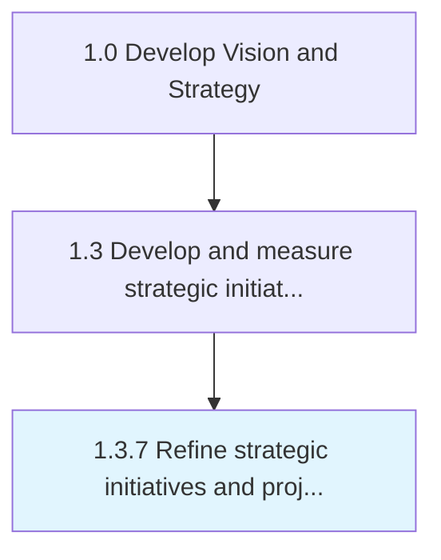

# Refine strategic initiatives and project plans as needed

> Performing required updates to strategic initiatives based upon changes in the marketplace or performance.

## Overview

Process 1.3.7 is a core process that defines the specific procedures for refine strategic initiatives and project plans as needed. 

Performing required updates to strategic initiatives based upon changes in the marketplace or performance.

## Process Hierarchy



## Key Statistics

| Metric | Value |
|--------|-------|
| APQC Code | 21423 |
| Hierarchy ID | 1.3.7 |
| Level | Process |
| Parent | [1.3](../) |
| Sub-Processes | 0 |


## GraphDL Semantic Structure

```
refine.StrategicInitiativesAndProjectPlansAsNeeded
```

| Component | Value | Description |
|-----------|-------|-------------|
| Verb | `refine` | Primary action |
| Object | `strategic initiatives and project plans as needed` | Direct object |


## Related Concepts

- [StrategicInitiatives](/concepts/StrategicInitiatives)
- [ProjectPlansAsNeeded](/concepts/ProjectPlansAsNeeded)


---

*Source: APQC PCF 21423 (1.3.7) - APQC*
