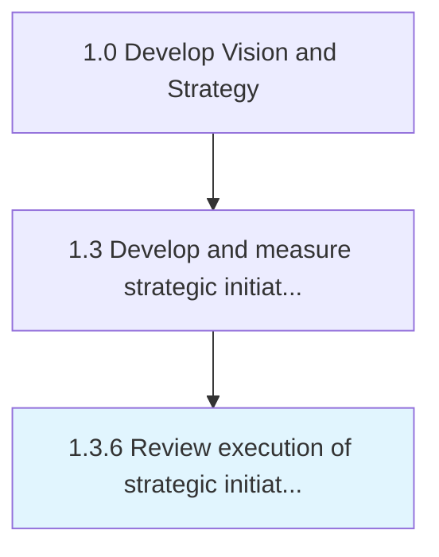

# Review execution of strategic initiatives

> Periodic review of initiatives based performance, conditions, and marketplace response.

## Overview

Process 1.3.6 is a core process that defines the specific procedures for review execution of strategic initiatives. 

Periodic review of initiatives based performance, conditions, and marketplace response.

## Process Hierarchy



## Key Statistics

| Metric | Value |
|--------|-------|
| APQC Code | 21422 |
| Hierarchy ID | 1.3.6 |
| Level | Process |
| Parent | [1.3](../) |
| Sub-Processes | 0 |


## GraphDL Semantic Structure

```
review.Execution.of.StrategicInitiatives
```

| Component | Value | Description |
|-----------|-------|-------------|
| Verb | `review` | Primary action |
| Object | `execution` | Direct object |
| Preposition | `of` | Relationship |
| PrepObject | `strategic initiatives` | Indirect object |


## Related Concepts

- [Execution](/concepts/Execution)
- [StrategicInitiatives](/concepts/StrategicInitiatives)


---

*Source: APQC PCF 21422 (1.3.6) - APQC*
