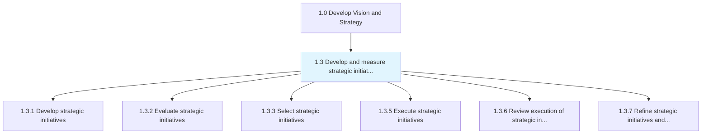
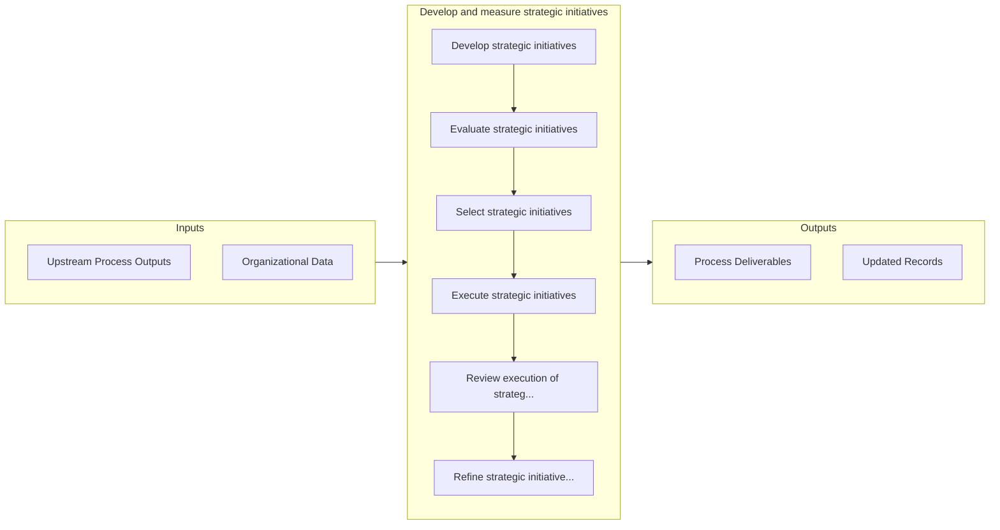

# Develop and measure strategic initiatives

> Managing strategic initiatives, from development through selection, execution, and evaluation.

## Overview

Group 1.3 is a process group within APQC Category 1.0 (Develop Vision and Strategy). 

Managing strategic initiatives, from development through selection, execution, and evaluation. Conduct and oversee strategic projects supporting long-term objectives. Administer programs of strategic significance by developing such initiatives, select the most appropriate projects, and formulate measures to assess their impact.

## Process Hierarchy



## Key Statistics

| Metric | Value |
|--------|-------|
| APQC Code | 10016 |
| Hierarchy ID | 1.3 |
| Level | Group |
| Parent | [1](../) |
| Sub-Processes | 6 |


## GraphDL Semantic Structure

```
develop.AndMeasureStrategicInitiatives
```

| Component | Value | Description |
|-----------|-------|-------------|
| Verb | `develop` | Primary action |
| Object | `and measure strategic initiatives` | Direct object |


## Process Flow



## Sub-Processes

| Process | Hierarchy ID | Description |
|---------|-------------|-------------|
| [Develop strategic initiatives](./1.3.1-DevelopStrategicInitiatives/) | 1.3.1 | Developing strategic projects that help fulfill long-term goals |
| [Evaluate strategic initiatives](./1.3.2-EvaluateStrategicInitiatives/) | 1.3.2 | Examining projects of strategic significance that lie outside the purview of the organization's rout |
| [Select strategic initiatives](./1.3.3-SelectStrategicInitiatives/) | 1.3.3 | Selecting relevant projects of strategic significance that create opportunities for the organization |
| [Execute strategic initiatives](./ExecuteStrategicInitiatives) | 1.3.5 | Successfully implement strategic initiatives |
| [Review execution of strategic initiatives](./ReviewExecutionOfStrategicInitiatives) | 1.3.6 | Periodic review of initiatives based performance, conditions, and marketplace response |
| [Refine strategic initiatives and project plans as needed](./RefineStrategicInitiativesAndProjectPlansAsNeeded) | 1.3.7 | Performing required updates to strategic initiatives based upon changes in the marketplace or perfor |


## Related Concepts

- StrategicInitiatives
- StrategicInitiatives


---

*Source: APQC PCF 10016 (1.3) - APQC*
