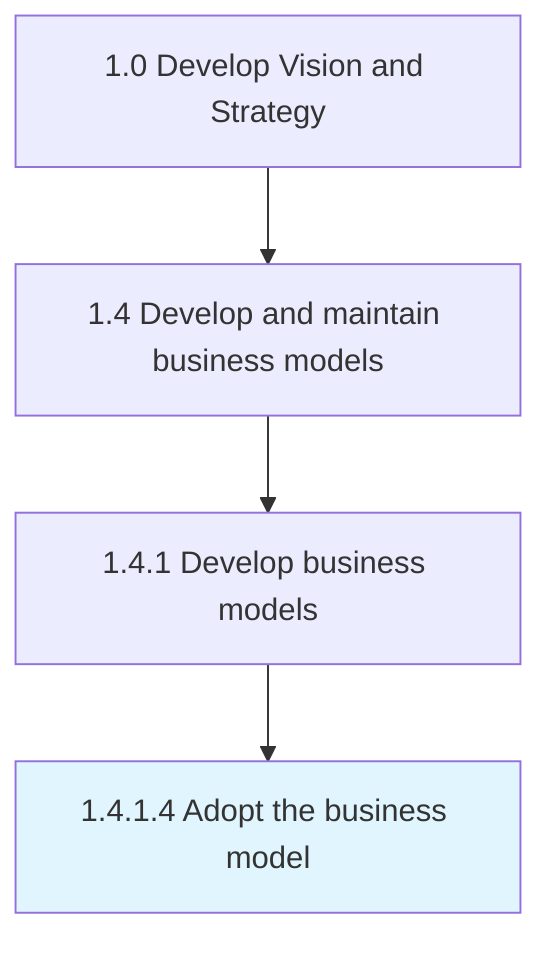

# Adopt the business model

> Consenting to a particular business model and formally accepting it to serve as the set of guiding principles in operating the company.

## Overview

Activity 1.4.1.4 is an activity within the Develop Vision and Strategy framework. 

Consenting to a particular business model and formally accepting it to serve as the set of guiding principles in operating the company.

## Process Hierarchy



## Key Statistics

| Metric | Value |
|--------|-------|
| APQC Code | 20949 |
| Hierarchy ID | 1.4.1.4 |
| Level | Activity |
| Parent | [1.4.1](../) |
| Sub-Processes | 0 |


## GraphDL Semantic Structure

```
adopt.TheBusinessModel
```

| Component | Value | Description |
|-----------|-------|-------------|
| Verb | `adopt` | Primary action |
| Object | `the business model` | Direct object |


## Related Concepts

- BusinessModel


---

*Source: APQC PCF 20949 (1.4.1.4) - APQC*
