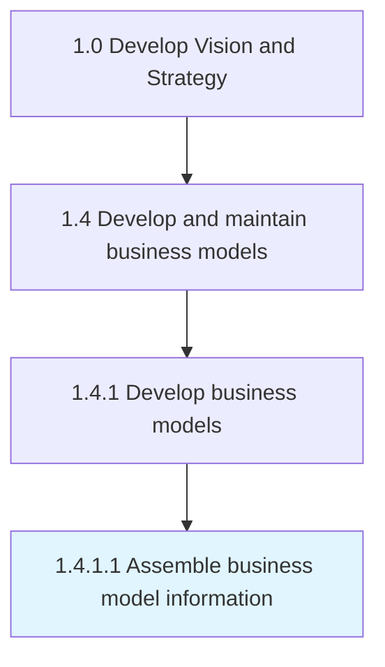

# Assemble business model information

> Collecting all relevant materials needed to develop the business model, so that it can adequately model its processes.

## Overview

Activity 1.4.1.1 is an activity within the Develop Vision and Strategy framework. 

Collecting all relevant materials needed to develop the business model, so that it can adequately model its processes.

## Process Hierarchy



## Key Statistics

| Metric | Value |
|--------|-------|
| APQC Code | 20946 |
| Hierarchy ID | 1.4.1.1 |
| Level | Activity |
| Parent | [1.4.1](../) |
| Sub-Processes | 0 |


## GraphDL Semantic Structure

```
assemble.BusinessModelInformation
```

| Component | Value | Description |
|-----------|-------|-------------|
| Verb | `assemble` | Primary action |
| Object | `business model information` | Direct object |


## Related Concepts

- [BusinessModelInformation](/concepts/BusinessModelInformation)


---

*Source: APQC PCF 20946 (1.4.1.1) - APQC*
