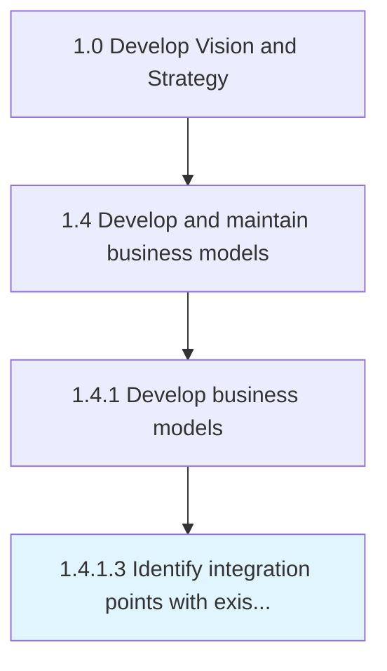

# Identify integration points with existing models

> Ensuring coherence with pre-exsiting models to avoid contradictions between models.

## Overview

Activity 1.4.1.3 is an activity within the Develop Vision and Strategy framework. 

Ensuring coherence with pre-exsiting models to avoid contradictions between models. Make sure that all models represent the same long-term vision.

## Process Hierarchy



## Key Statistics

| Metric | Value |
|--------|-------|
| APQC Code | 20948 |
| Hierarchy ID | 1.4.1.3 |
| Level | Activity |
| Parent | [1.4.1](../) |
| Sub-Processes | 0 |


## GraphDL Semantic Structure

```
identify.IntegrationPoints.with.ExistingModels
```

| Component | Value | Description |
|-----------|-------|-------------|
| Verb | `identify` | Primary action |
| Object | `integration points` | Direct object |
| Preposition | `with` | Relationship |
| PrepObject | `existing models` | Indirect object |


## Related Concepts

- [IntegrationPoints](/concepts/IntegrationPoints)
- [ExistingModels](/concepts/ExistingModels)


---

*Source: APQC PCF 20948 (1.4.1.3) - APQC*
