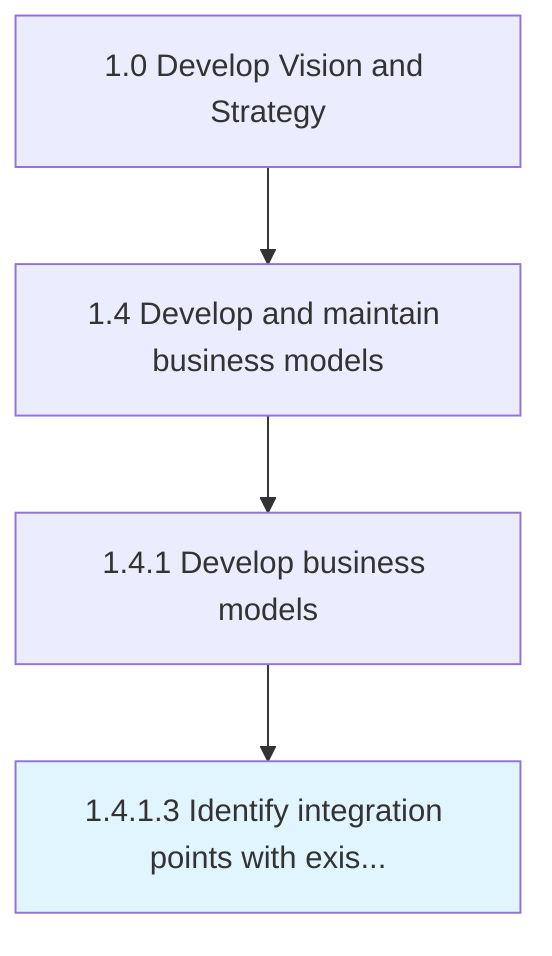
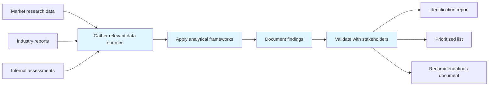

# Identify integration points with existing models

> Ensuring coherence with pre-exsiting models to avoid contradictions between models.

## Overview

Activity 1.4.1.3 is an activity within the Develop Vision and Strategy framework. 

Ensuring coherence with pre-exsiting models to avoid contradictions between models. Make sure that all models represent the same long-term vision.

This process plays a critical role within the broader "Develop Vision and Strategy" capability area (APQC Category 1.0). By systematically executing this activity, organizations ensure that strategic decisions are grounded in thorough analysis and aligned with overall business objectives. The outputs of this process feed into downstream strategy development and execution activities, creating a foundation for informed decision-making across the enterprise.

## Process Hierarchy



## Key Statistics

| Metric | Value |
|--------|-------|
| APQC Code | 20948 |
| Hierarchy ID | 1.4.1.3 |
| Level | Activity |
| Parent | [1.4.1](../) |
| Sub-Processes | 0 |
| Estimated Duration | 1-4 weeks |
| Complexity | Medium |

## GraphDL Semantic Structure

```
identify.IntegrationPoints.with.ExistingModels
```

| Component | Value | Description |
|-----------|-------|-------------|
| Verb | `identify` | Primary action |
| Object | `integration points` | Direct object |
| Preposition | `with` | Relationship |
| PrepObject | `existing models` | Indirect object |

## Process Flow



## RACI Matrix

| Activity | Responsible | Accountable | Consulted | Informed |
|----------|-------------|-------------|-----------|----------|
| Gather model inputs | Business Architect | Strategy Director | Business Unit Leaders | Stakeholders |
| Design and build model | Business Architect | Chief Strategy Officer | Subject Matter Experts | Department Heads |
| Validate and approve | Strategy Director | Chief Executive Officer | External Advisors | Board of Directors |
| Maintain and update | Business Analyst | Business Architect | Model Users | All Stakeholders |

## Related Occupations

| Occupation | Role in Process |
|------------|----------------|
| [Chief Executives](/occupations/ChiefExecutives) | Primary strategic oversight and decision authority |
| [Management Analysts](/occupations/ManagementAnalysts) | Executes analysis and produces deliverables |
| [Business Intelligence Analysts](/occupations/BusinessIntelligenceAnalysts) | Provides analytical frameworks and recommendations |
| [Financial Managers](/occupations/FinancialManagers) | Supports data gathering and insight generation |
| [Strategic Planners](/occupations/StrategicPlanners) | Coordinates strategic alignment and planning |

## Related Departments

| Department | Involvement |
|------------|-------------|
| [Strategy & Planning](/departments/StrategyAndPlanning) | Primary owner and executor of this process |
| [Business Architecture](/departments/BusinessArchitecture) | Provides supporting data, resources, and coordination |
| [Executive Leadership](/departments/ExecutiveLeadership) | Provides governance, approval, and strategic direction |

## Industry Variations

| Industry | Variation | Reference |
|----------|-----------|-----------|
| Manufacturing | Emphasizes supply chain and operational efficiency metrics in strategic planning | [manufacturing](/industries/manufacturing) |
| Financial Services | Focuses on regulatory compliance and risk management within strategy processes | [banking](/industries/banking) |
| Technology | Prioritizes innovation velocity and digital transformation in strategic initiatives | [consumer-electronics](/industries/consumer-electronics) |

## KPIs & Metrics

| KPI | Description | Target |
|-----|-------------|--------|
| Completeness Rate | Percentage of relevant items identified vs. total known | > 85% |
| Time to Identification | Average time from initiation to completion | < 2 weeks |
| Stakeholder Satisfaction | Satisfaction score from key stakeholders | > 4.0/5.0 |

## Related Concepts

- IntegrationPoints
- ExistingModels

---

*Source: APQC PCF 20948 (1.4.1.3) - APQC*
