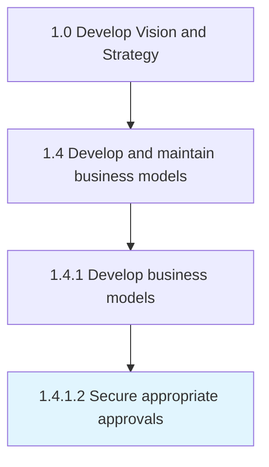
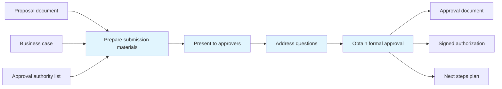

# Secure appropriate approvals

> Obtaining required permissions, licenses and authorizations that legitimize the business, help to mitigate associated risks and safeguard the operations.

## Overview

Activity 1.4.1.2 is an activity within the Develop Vision and Strategy framework. 

Obtaining required permissions, licenses and authorizations that legitimize the business, help to mitigate associated risks and safeguard the operations.

This process plays a critical role within the broader "Develop Vision and Strategy" capability area (APQC Category 1.0). By systematically executing this activity, organizations ensure that strategic decisions are grounded in thorough analysis and aligned with overall business objectives. The outputs of this process feed into downstream strategy development and execution activities, creating a foundation for informed decision-making across the enterprise.

## Process Hierarchy



## Key Statistics

| Metric | Value |
|--------|-------|
| APQC Code | 20947 |
| Hierarchy ID | 1.4.1.2 |
| Level | Activity |
| Parent | [1.4.1](../) |
| Sub-Processes | 0 |
| Estimated Duration | 1-4 weeks |
| Complexity | Medium |

## GraphDL Semantic Structure

```
secure.AppropriateApprovals
```

| Component | Value | Description |
|-----------|-------|-------------|
| Verb | `secure` | Primary action |
| Object | `appropriate approvals` | Direct object |

## Process Flow



## RACI Matrix

| Activity | Responsible | Accountable | Consulted | Informed |
|----------|-------------|-------------|-----------|----------|
| Gather model inputs | Business Architect | Strategy Director | Business Unit Leaders | Stakeholders |
| Design and build model | Business Architect | Chief Strategy Officer | Subject Matter Experts | Department Heads |
| Validate and approve | Strategy Director | Chief Executive Officer | External Advisors | Board of Directors |
| Maintain and update | Business Analyst | Business Architect | Model Users | All Stakeholders |

## Related Occupations

| Occupation | Role in Process |
|------------|----------------|
| [Chief Executives](/occupations/ChiefExecutives) | Primary strategic oversight and decision authority |
| [Management Analysts](/occupations/ManagementAnalysts) | Executes analysis and produces deliverables |
| [Business Intelligence Analysts](/occupations/BusinessIntelligenceAnalysts) | Provides analytical frameworks and recommendations |
| [Financial Managers](/occupations/FinancialManagers) | Supports data gathering and insight generation |
| [Strategic Planners](/occupations/StrategicPlanners) | Coordinates strategic alignment and planning |

## Related Departments

| Department | Involvement |
|------------|-------------|
| [Strategy & Planning](/departments/StrategyAndPlanning) | Primary owner and executor of this process |
| [Business Architecture](/departments/BusinessArchitecture) | Provides supporting data, resources, and coordination |
| [Executive Leadership](/departments/ExecutiveLeadership) | Provides governance, approval, and strategic direction |

## Industry Variations

| Industry | Variation | Reference |
|----------|-----------|-----------|
| Manufacturing | Emphasizes supply chain and operational efficiency metrics in strategic planning | [manufacturing](/industries/manufacturing) |
| Financial Services | Focuses on regulatory compliance and risk management within strategy processes | [banking](/industries/banking) |
| Technology | Prioritizes innovation velocity and digital transformation in strategic initiatives | [consumer-electronics](/industries/consumer-electronics) |

## KPIs & Metrics

| KPI | Description | Target |
|-----|-------------|--------|
| Process Completion Rate | Percentage of process completed on schedule | > 95% |
| Stakeholder Satisfaction | Average satisfaction rating from involved parties | > 4.0/5.0 |
| Output Quality Score | Quality assessment of process deliverables | > 80% |

## Related Concepts

- AppropriateApprovals

---

*Source: APQC PCF 20947 (1.4.1.2) - APQC*
