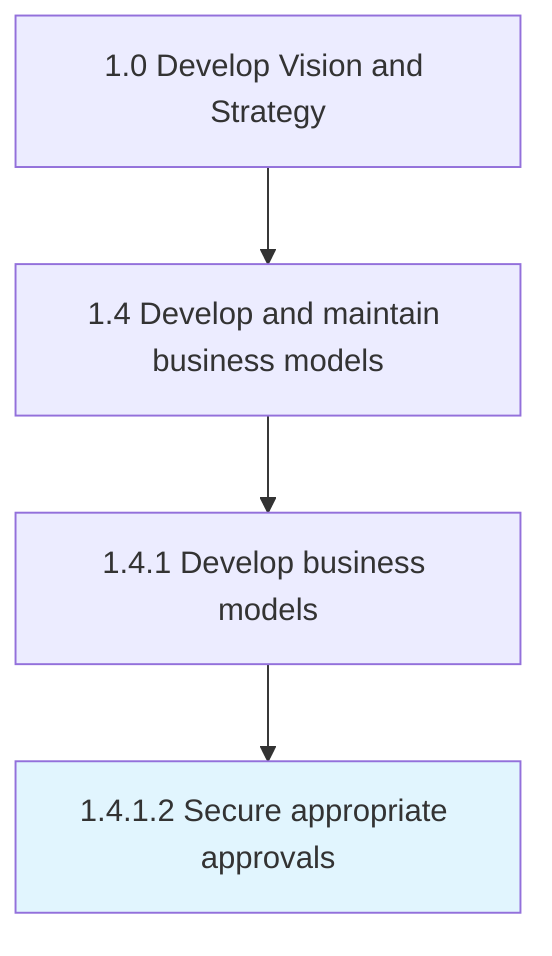

# Secure appropriate approvals

> Obtaining required permissions, licenses and authorizations that legitimize the business, help to mitigate associated risks and safeguard the operations.

## Overview

Activity 1.4.1.2 is an activity within the Develop Vision and Strategy framework. 

Obtaining required permissions, licenses and authorizations that legitimize the business, help to mitigate associated risks and safeguard the operations.

## Process Hierarchy



## Key Statistics

| Metric | Value |
|--------|-------|
| APQC Code | 20947 |
| Hierarchy ID | 1.4.1.2 |
| Level | Activity |
| Parent | [1.4.1](../) |
| Sub-Processes | 0 |


## GraphDL Semantic Structure

```
secure.AppropriateApprovals
```

| Component | Value | Description |
|-----------|-------|-------------|
| Verb | `secure` | Primary action |
| Object | `appropriate approvals` | Direct object |


## Related Concepts

- [AppropriateApprovals](/concepts/AppropriateApprovals)


---

*Source: APQC PCF 20947 (1.4.1.2) - APQC*
