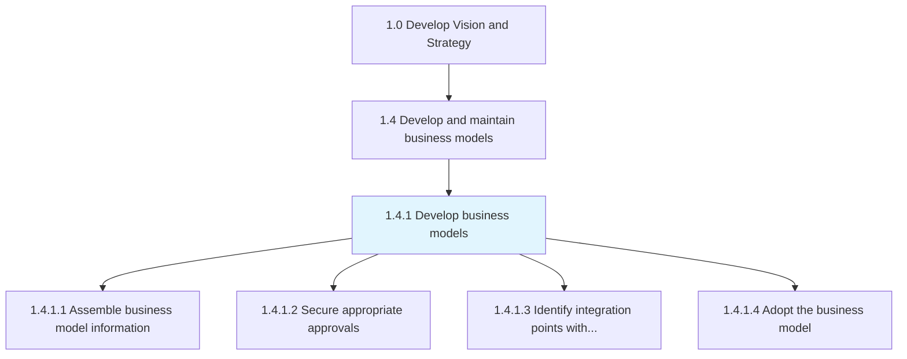
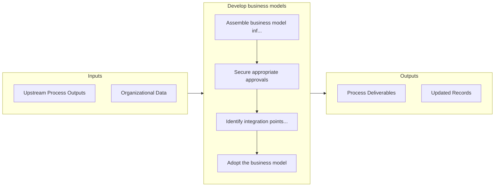

# Develop business models

> Creating an economic model that describes the goals of an organization and the business processes needed to achieve those goals.

## Overview

Process 1.4.1 is a core process that defines the specific procedures for develop business models. 

Creating an economic model that describes the goals of an organization and the business processes needed to achieve those goals. This involves information gathering, securing necessary approvals and authorizations, integrating with preexisting models, including the general business concept [10002] and business strategy [10015], and formally accepting the model as the basis for organization's day-to-day operations.

## Process Hierarchy



## Key Statistics

| Metric | Value |
|--------|-------|
| APQC Code | 20945 |
| Hierarchy ID | 1.4.1 |
| Level | Process |
| Parent | [1.4](../) |
| Sub-Processes | 4 |


## GraphDL Semantic Structure

```
develop.BusinessModels
```

| Component | Value | Description |
|-----------|-------|-------------|
| Verb | `develop` | Primary action |
| Object | `business models` | Direct object |


## Process Flow



## Sub-Processes

| Process | Hierarchy ID | Description |
|---------|-------------|-------------|
| [Assemble business model information](./AssembleBusinessModelInformation) | 1.4.1.1 | Collecting all relevant materials needed to develop the business model, so that it can adequately mo |
| [Secure appropriate approvals](./SecureAppropriateApprovals) | 1.4.1.2 | Obtaining required permissions, licenses and authorizations that legitimize the business, help to mi |
| [Identify integration points with existing models](./IdentifyIntegrationPointsWithExistingModels) | 1.4.1.3 | Ensuring coherence with pre-exsiting models to avoid contradictions between models |
| [Adopt the business model](./AdoptTheBusinessModel) | 1.4.1.4 | Consenting to a particular business model and formally accepting it to serve as the set of guiding p |


## Related Concepts

- [BusinessModels](/concepts/BusinessModels)


---

*Source: APQC PCF 20945 (1.4.1) - APQC*
