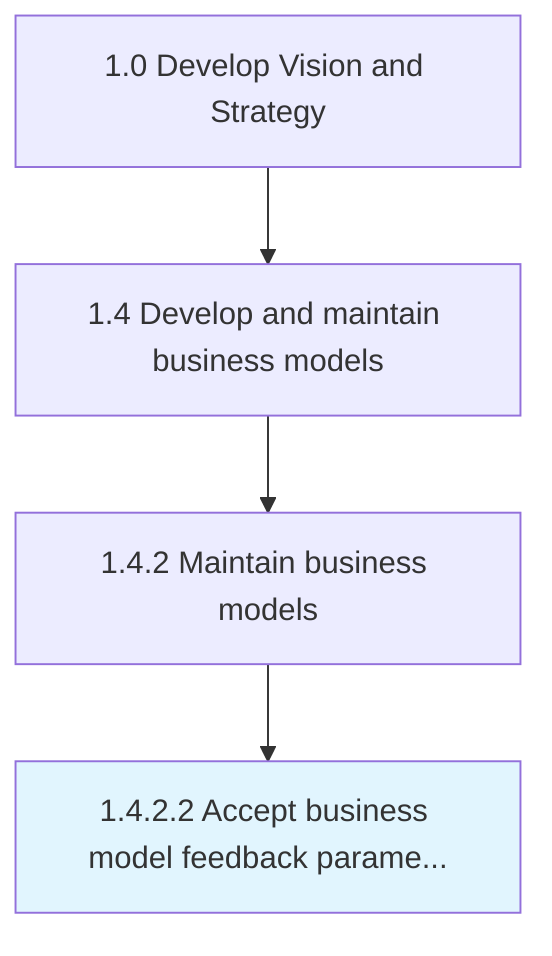

# Accept business model feedback parameters

> Deciding the type of responses, reactions, sentiments and insights that are crucial to be taken into consideration with business model maintenance.

## Overview

Activity 1.4.2.2 is an activity within the Develop Vision and Strategy framework. 

Deciding the type of responses, reactions, sentiments and insights that are crucial to be taken into consideration with business model maintenance.

## Process Hierarchy



## Key Statistics

| Metric | Value |
|--------|-------|
| APQC Code | 20952 |
| Hierarchy ID | 1.4.2.2 |
| Level | Activity |
| Parent | [1.4.2](../) |
| Sub-Processes | 0 |


## GraphDL Semantic Structure

```
accept.BusinessModelFeedbackParameters
```

| Component | Value | Description |
|-----------|-------|-------------|
| Verb | `accept` | Primary action |
| Object | `business model feedback parameters` | Direct object |


## Related Concepts

- [BusinessModelFeedbackParameters](/concepts/BusinessModelFeedbackParameters)


---

*Source: APQC PCF 20952 (1.4.2.2) - APQC*
