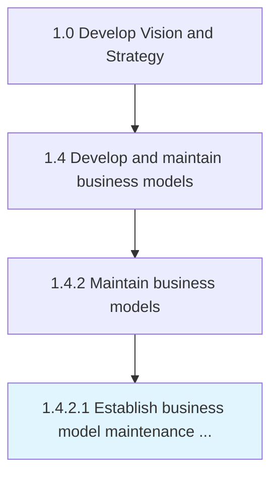

# Establish business model maintenance parameters

> Determining the timeline, procedures and responsibilities for reviewing the business model and for updating it to best serve the organization.

## Overview

Activity 1.4.2.1 is an activity within the Develop Vision and Strategy framework. 

Determining the timeline, procedures and responsibilities for reviewing the business model and for updating it to best serve the organization.

## Process Hierarchy



## Key Statistics

| Metric | Value |
|--------|-------|
| APQC Code | 20951 |
| Hierarchy ID | 1.4.2.1 |
| Level | Activity |
| Parent | [1.4.2](../) |
| Sub-Processes | 0 |


## GraphDL Semantic Structure

```
establish.BusinessModelMaintenanceParameters
```

| Component | Value | Description |
|-----------|-------|-------------|
| Verb | `establish` | Primary action |
| Object | `business model maintenance parameters` | Direct object |


## Related Concepts

- BusinessModelMaintenanceParameters


---

*Source: APQC PCF 20951 (1.4.2.1) - APQC*
