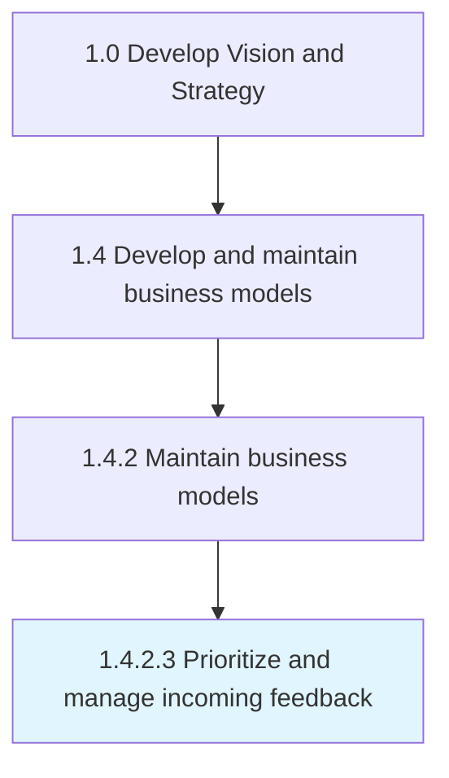

# Prioritize and manage incoming feedback

> Evaluating the feedback regarding products, services, processes or resources.

## Overview

Activity 1.4.2.3 is an activity within the Develop Vision and Strategy framework. 

Evaluating the feedback regarding products, services, processes or resources. Determine which judgments are critical and mandate changes to the current business model to better deliver the desired value

## Process Hierarchy



## Key Statistics

| Metric | Value |
|--------|-------|
| APQC Code | 20953 |
| Hierarchy ID | 1.4.2.3 |
| Level | Activity |
| Parent | [1.4.2](../) |
| Sub-Processes | 0 |


## GraphDL Semantic Structure

```
prioritize.AndManageIncomingFeedback
```

| Component | Value | Description |
|-----------|-------|-------------|
| Verb | `prioritize` | Primary action |
| Object | `and manage incoming feedback` | Direct object |


## Related Concepts

- [IncomingFeedback](/concepts/IncomingFeedback)
- [IncomingFeedback](/concepts/IncomingFeedback)


---

*Source: APQC PCF 20953 (1.4.2.3) - APQC*
