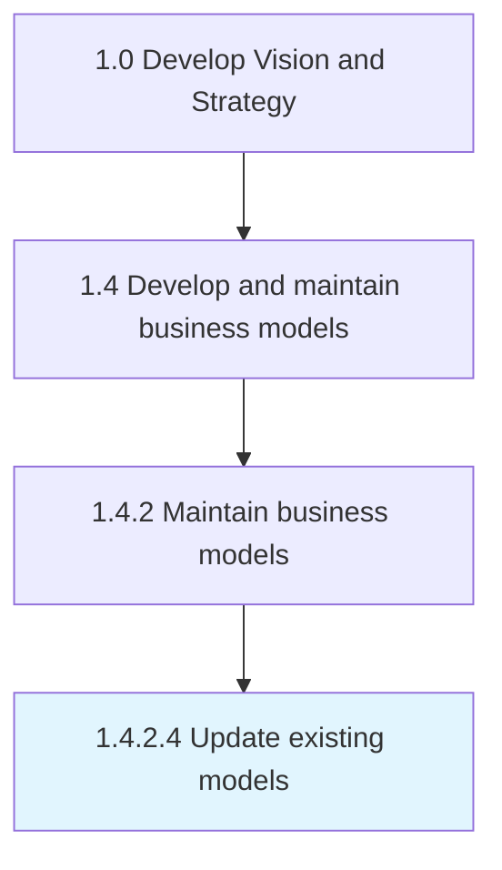

# Update existing models

> Modifying the business models that are presently in use in response to incoming feedback or changing markets to achieve the enterprise business goals.

## Overview

Activity 1.4.2.4 is an activity within the Develop Vision and Strategy framework. 

Modifying the business models that are presently in use in response to incoming feedback or changing markets to achieve the enterprise business goals.

## Process Hierarchy



## Key Statistics

| Metric | Value |
|--------|-------|
| APQC Code | 20954 |
| Hierarchy ID | 1.4.2.4 |
| Level | Activity |
| Parent | [1.4.2](../) |
| Sub-Processes | 0 |


## GraphDL Semantic Structure

```
update.ExistingModels
```

| Component | Value | Description |
|-----------|-------|-------------|
| Verb | `update` | Primary action |
| Object | `existing models` | Direct object |


## Related Concepts

- [ExistingModels](/concepts/ExistingModels)


---

*Source: APQC PCF 20954 (1.4.2.4) - APQC*
