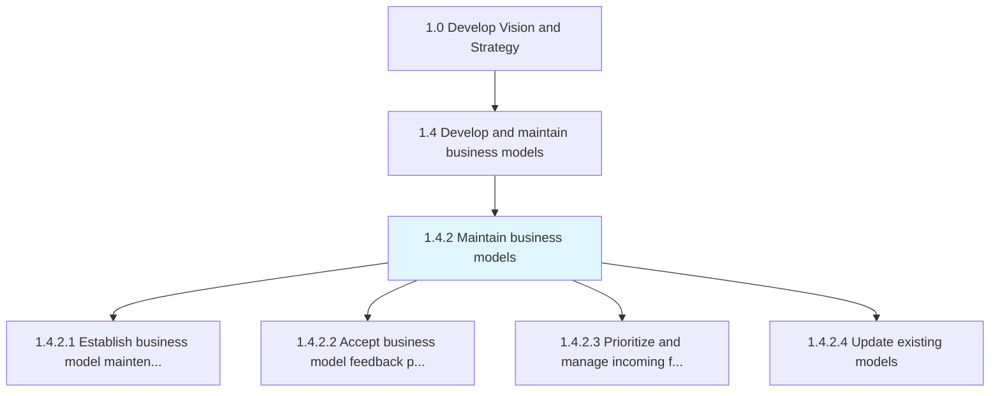
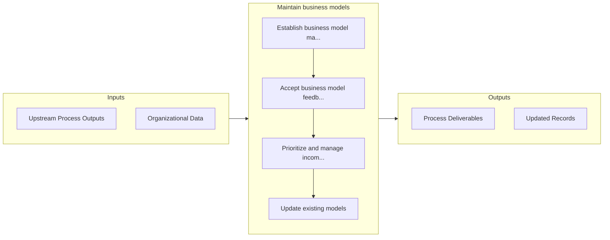

# Maintain business models

> Revising and updating business models to reflect the changes in the marketed services, product inventory, market behavior, available resources or accrued expenses.

## Overview

Process 1.4.2 is a core process that defines the specific procedures for maintain business models. 

Revising and updating business models to reflect the changes in the marketed services, product inventory, market behavior, available resources or accrued expenses. Determine how and when to modify the accepted business model in response to incoming feedback.

## Process Hierarchy



## Key Statistics

| Metric | Value |
|--------|-------|
| APQC Code | 20950 |
| Hierarchy ID | 1.4.2 |
| Level | Process |
| Parent | [1.4](../) |
| Sub-Processes | 4 |


## GraphDL Semantic Structure

```
maintain.BusinessModels
```

| Component | Value | Description |
|-----------|-------|-------------|
| Verb | `maintain` | Primary action |
| Object | `business models` | Direct object |


## Process Flow



## Sub-Processes

| Process | Hierarchy ID | Description |
|---------|-------------|-------------|
| [Establish business model maintenance parameters](./EstablishBusinessModelMaintenanceParameters) | 1.4.2.1 | Determining the timeline, procedures and responsibilities for reviewing the business model and for u |
| [Accept business model feedback parameters](./AcceptBusinessModelFeedbackParameters) | 1.4.2.2 | Deciding the type of responses, reactions, sentiments and insights that are crucial to be taken into |
| [Prioritize and manage incoming feedback](./PrioritizeAndManageIncomingFeedback) | 1.4.2.3 | Evaluating the feedback regarding products, services, processes or resources |
| [Update existing models](./UpdateExistingModels) | 1.4.2.4 | Modifying the business models that are presently in use in response to incoming feedback or changing |


## Related Concepts

- [BusinessModels](/concepts/BusinessModels)


---

*Source: APQC PCF 20950 (1.4.2) - APQC*
