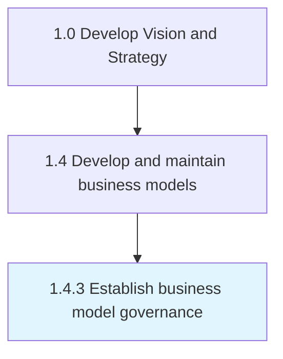

# Establish business model governance

> Creating and implementing a strategy, responsibilities and control mechanisms for managing business models that are timely, efficient and cost-effective.

## Overview

Process 1.4.3 is a core process that defines the specific procedures for establish business model governance. 

Creating and implementing a strategy, responsibilities and control mechanisms for managing business models that are timely, efficient and cost-effective.

## Process Hierarchy



## Key Statistics

| Metric | Value |
|--------|-------|
| APQC Code | 20955 |
| Hierarchy ID | 1.4.3 |
| Level | Process |
| Parent | [1.4](../) |
| Sub-Processes | 0 |


## GraphDL Semantic Structure

```
establish.BusinessModelGovernance
```

| Component | Value | Description |
|-----------|-------|-------------|
| Verb | `establish` | Primary action |
| Object | `business model governance` | Direct object |


## Related Concepts

- BusinessModelGovernance


---

*Source: APQC PCF 20955 (1.4.3) - APQC*
