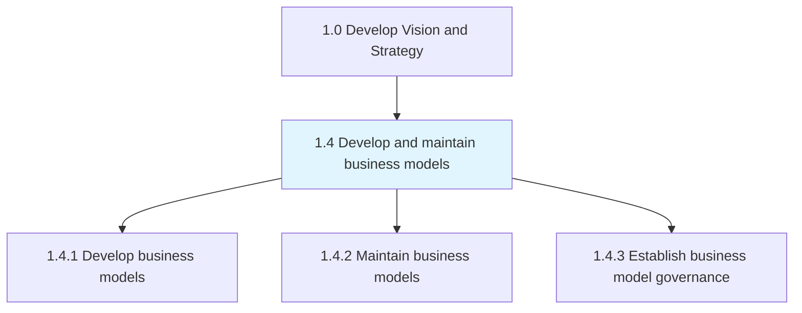
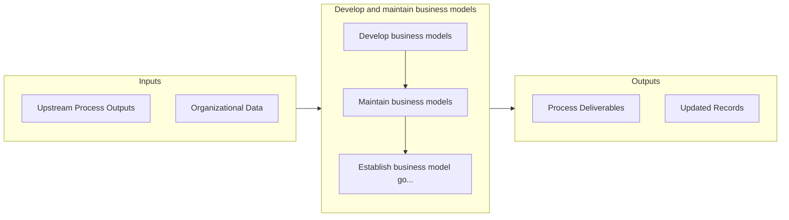

# Develop and maintain business models

> Establishing how an organization creates, delivers and captures value or makes profit.

## Overview

Group 1.4 is a process group within APQC Category 1.0 (Develop Vision and Strategy). 

Establishing how an organization creates, delivers and captures value or makes profit. Identify the products or services that a business will sell, its target market, anticipated expenses, and other core aspects of its modus operandi. Revise the plan as required to reflect changing circumstances.

## Process Hierarchy



## Key Statistics

| Metric | Value |
|--------|-------|
| APQC Code | 20944 |
| Hierarchy ID | 1.4 |
| Level | Group |
| Parent | [1](../) |
| Sub-Processes | 3 |


## GraphDL Semantic Structure

```graphdl
develop.AndMaintainBusinessModels
```

| Component | Value | Description |
|-----------|-------|-------------|
| Verb | `develop` | Primary action |
| Object | `and maintain business models` | Direct object |


## Process Flow



## Sub-Processes

| Process | Hierarchy ID | Description |
|---------|-------------|-------------|
| [Develop business models](./1.4.1-DevelopBusinessModels/) | 1.4.1 | Creating an economic model that describes the goals of an organization and the business processes ne |
| [Maintain business models](./1.4.2-MaintainBusinessModels/) | 1.4.2 | Revising and updating business models to reflect the changes in the marketed services, product inven |
| [Establish business model governance](./EstablishBusinessModelGovernance) | 1.4.3 | Creating and implementing a strategy, responsibilities and control mechanisms for managing business  |


## Related Concepts

- BusinessModels
- BusinessModels


---

*Source: APQC PCF 20944 (1.4) - APQC*
