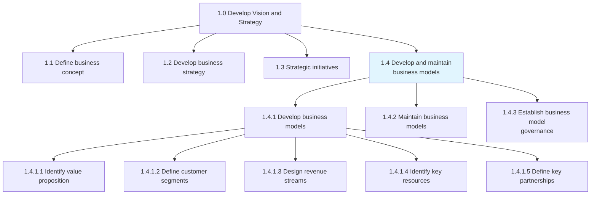
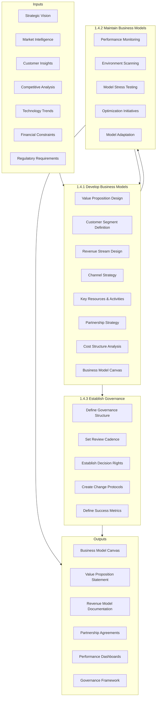
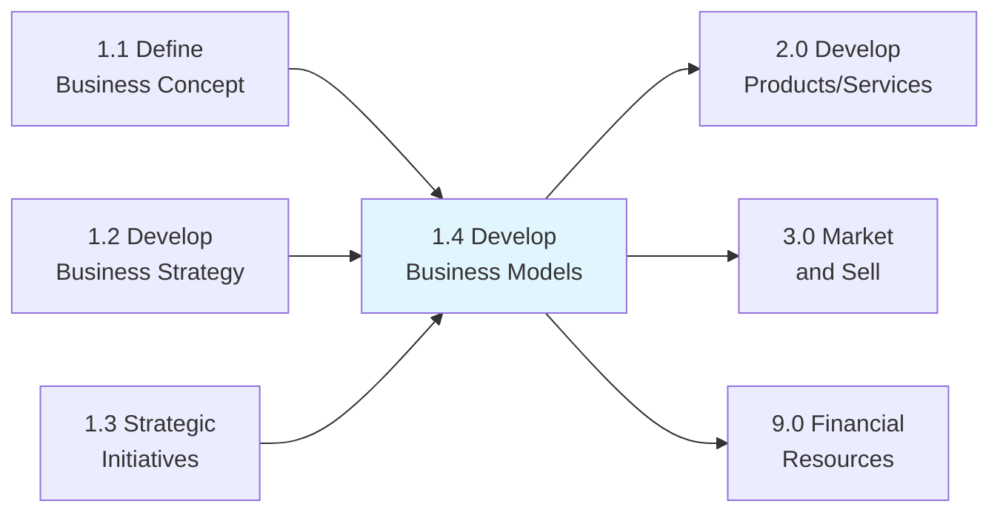

# Develop and maintain business models

> Establishing how an organization creates, delivers and captures value or makes profit.

## Overview

Process Group 1.4 - Develop and Maintain Business Models is a critical process group within the Vision and Strategy category. This group encompasses all activities related to defining, designing, testing, and evolving the organization's business model.

A business model describes the rationale of how an organization creates, delivers, and captures value. It encompasses the value proposition offered to customers, the customer segments served, the channels used to reach them, customer relationships, revenue streams, key resources and activities, key partnerships, and cost structure.

In today's rapidly changing business environment, business model innovation has become as important as product or service innovation. Organizations must continuously evaluate and adapt their business models to respond to competitive pressures, technological disruption, changing customer expectations, and new market opportunities.

## Process Hierarchy



## Key Statistics

| Metric | Value |
|--------|-------|
| APQC Code | 20944 |
| Hierarchy ID | 1.4 |
| Level | Process Group |
| Parent | [1.0 Develop Vision and Strategy](../) |
| Child Processes | 3 |
| Total Activities | 15+ |
| Review Frequency | Annually or upon disruption |

## GraphDL Semantic Structure

```graphdl
develop.BusinessModels
maintain.BusinessModels
```

| Component | Value | Description |
|-----------|-------|-------------|
| Verb | `develop` | Creating new business models |
| Verb | `maintain` | Evolving existing models |
| Object | `BusinessModels` | Value creation and capture mechanisms |

## Process Flow



## Child Processes

### [1.4.1 Develop business models](./1.4.1-DevelopBusinessModels/)

Creating an economic model that describes the goals of an organization and the business processes needed to deliver value to customers while generating sustainable revenue and profit.

**Key Activities:**
- Identify and articulate value proposition
- Define target customer segments
- Design revenue streams and pricing models
- Map channels to market
- Identify key resources, activities, and capabilities
- Define strategic partnerships
- Analyze cost structure

**APQC Code:** 20945 | **Typical Duration:** 4-12 weeks

### [1.4.2 Maintain business models](./1.4.2-MaintainBusinessModels/)

Revising and updating business models to reflect changes in the marketed services, product inventory, target markets, channel strategies, and competitive landscape.

**Key Activities:**
- Monitor business model performance
- Track market and competitive changes
- Identify optimization opportunities
- Test model adaptations
- Implement model updates
- Communicate changes to stakeholders

**APQC Code:** 20946 | **Frequency:** Quarterly review, annual deep-dive

### [1.4.3 Establish business model governance](./EstablishBusinessModelGovernance/)

Creating and implementing a strategy, responsibilities, and control mechanisms for managing business model decisions and changes.

**Key Activities:**
- Define governance structure and roles
- Establish review and approval processes
- Create change management protocols
- Set performance metrics and thresholds
- Document decision rights and escalation paths

**APQC Code:** 20947 | **Scope:** Ongoing

## Business Model Components

| Component | Description | Key Questions |
|-----------|-------------|---------------|
| Value Proposition | Products/services that create value | What value do we deliver? What problem do we solve? |
| Customer Segments | Groups of people/organizations served | For whom are we creating value? Who are our customers? |
| Channels | How value proposition is delivered | How do we reach our customers? Which channels work best? |
| Customer Relationships | Types of relationships established | What relationships do our customers expect? |
| Revenue Streams | Cash generated from each segment | For what value are customers willing to pay? |
| Key Resources | Most important assets required | What key resources do our value propositions require? |
| Key Activities | Most important things the company does | What key activities do our value propositions require? |
| Key Partnerships | Network of suppliers and partners | Who are our key partners and suppliers? |
| Cost Structure | Costs incurred to operate the model | What are the most important costs? |

## RACI Matrix

| Activity | Responsible | Accountable | Consulted | Informed |
|----------|-------------|-------------|-----------|----------|
| Value proposition design | Product/Strategy | CEO | Sales, Marketing | All Functions |
| Customer segment definition | Marketing | CMO | Sales, Strategy | Product |
| Revenue model design | Finance/Strategy | CFO | Sales, Product | Board |
| Partnership strategy | Business Development | CEO | Legal, Operations | Finance |
| Business model governance | Strategy | Board/CEO | All Executives | Investors |
| Model performance monitoring | Finance/Strategy | CFO | All Functions | Leadership |
| Model adaptation decisions | Executive Team | CEO | Board | All |

## Metrics & KPIs

| Metric | Description | Target | Frequency |
|--------|-------------|--------|-----------|
| Customer Acquisition Cost | Cost to acquire new customers | Decreasing trend | Monthly |
| Customer Lifetime Value | Total value from a customer relationship | Increasing trend | Quarterly |
| Revenue per Customer | Average revenue generated per customer | Industry benchmark | Monthly |
| Gross Margin | Revenue minus cost of goods sold | >40% (varies by industry) | Monthly |
| Market Share | Percentage of total market served | Growing | Quarterly |
| Partnership Value | Revenue/cost savings from partnerships | Positive ROI | Annually |
| Model Adaptation Speed | Time to implement model changes | <90 days | Per change |
| Value Proposition Fit | Customer satisfaction with offering | >8/10 | Quarterly |

## Related Departments

| Department | Role in Business Model |
|------------|----------------------|
| Strategy | Model design and governance ownership |
| Finance | Revenue and cost structure design |
| Marketing | Customer segment and channel definition |
| Sales | Channel execution and customer feedback |
| Product | Value proposition design and delivery |
| Operations | Key activities and resource management |
| Partnerships | Partner ecosystem development |
| Legal | Contract and compliance oversight |

## Related Occupations

- [Chief Executive Officers](/occupations/Management/ChiefExecutives) - Model accountability
- [Chief Strategy Officers](/occupations/Management/StrategyOfficers) - Model development leadership
- [Chief Financial Officers](/occupations/Management/FinancialManagers) - Revenue and cost structure
- [Chief Marketing Officers](/occupations/Management/MarketingManagers) - Customer and channel strategy
- [Business Development Managers](/occupations/Business/BusinessDevelopment) - Partnership development
- [Product Managers](/occupations/Business/ProductManagers) - Value proposition design
- [Management Consultants](/occupations/Business/ManagementAnalysts) - Model innovation advisory

## Industry Variations

### Technology/SaaS
Subscription-based revenue models, freemium strategies, platform economics, network effects, and API-based partnerships. Emphasis on unit economics and customer lifetime value.

### Retail
Omnichannel models, marketplace integration, private label strategies, and loyalty program economics. Focus on inventory turns and customer acquisition costs.

### Banking & Financial Services
Fee-based and interest-based revenue streams, digital channel optimization, open banking partnerships. Regulatory constraints shape model options.

### Healthcare
Value-based care models, risk-sharing arrangements, population health economics. Payer mix optimization and regulatory compliance critical.

### Manufacturing
Direct vs. distribution models, aftermarket services, outcome-based pricing, servitization. Capital intensity and supply chain configuration key factors.

### Media & Entertainment
Advertising, subscription, and hybrid models. Content licensing, syndication, and platform distribution strategies.

## Business Model Innovation Patterns

| Pattern | Description | Example |
|---------|-------------|---------|
| Freemium | Free basic offering, paid premium | Spotify, LinkedIn |
| Platform | Multi-sided marketplace | Uber, Airbnb |
| Subscription | Recurring revenue model | Netflix, Adobe |
| Pay-per-use | Usage-based pricing | AWS, utilities |
| Razor and blade | Low margin core, high margin consumables | Printers, razors |
| Franchise | Fee-based replication | McDonald's, 7-Eleven |
| Direct-to-consumer | Disintermediation | Warby Parker, Dollar Shave |

## Related Processes



## Related Concepts

- Business Model Canvas
- Value Proposition
- Revenue Streams
- Cost Structure
- Customer Segments
- Value Creation
- Business Model Innovation

---

*Source: APQC PCF 20944 (1.4) - Cross-Industry*
