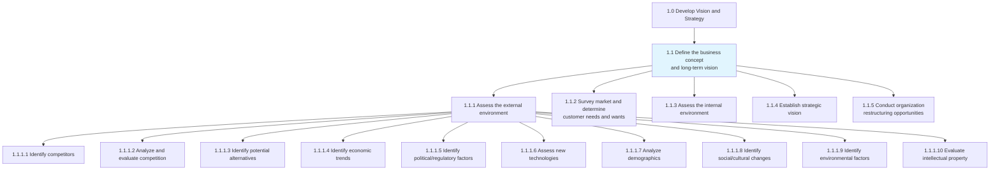
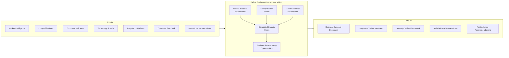
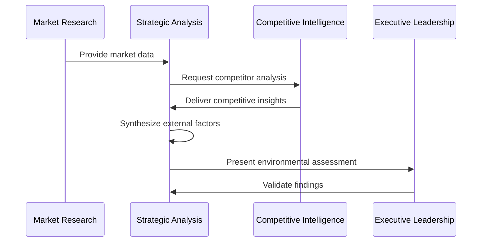
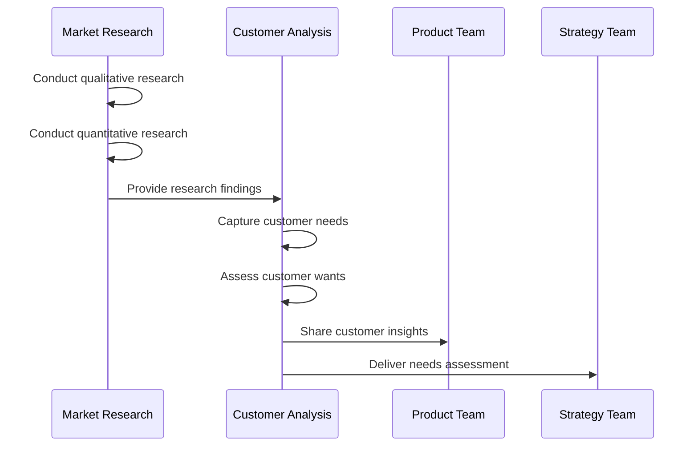
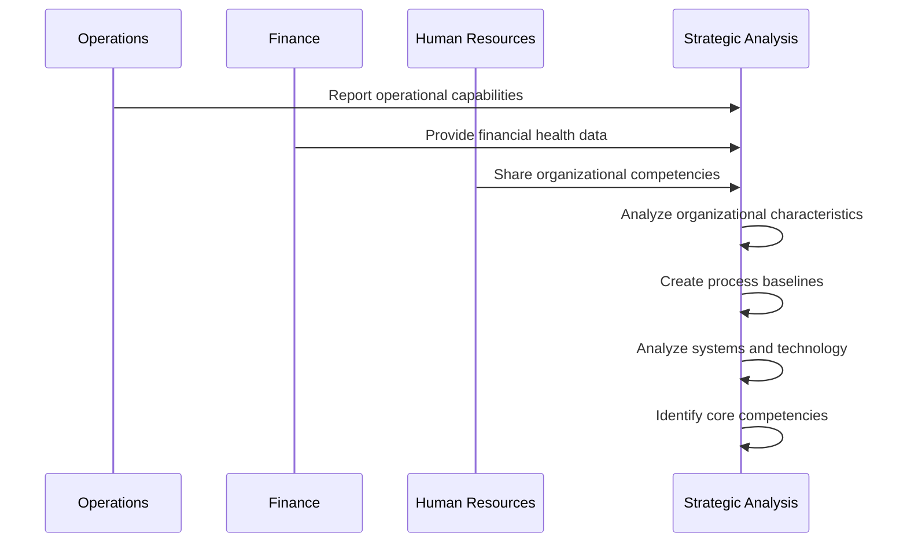
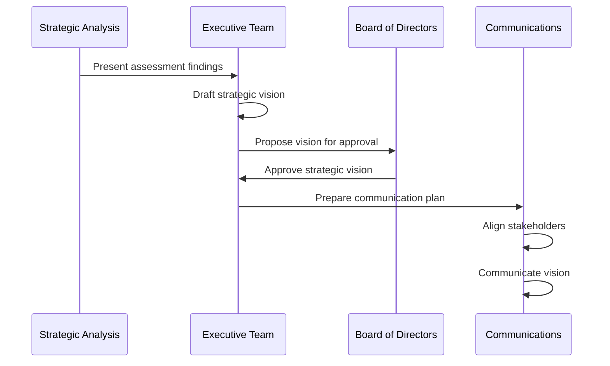
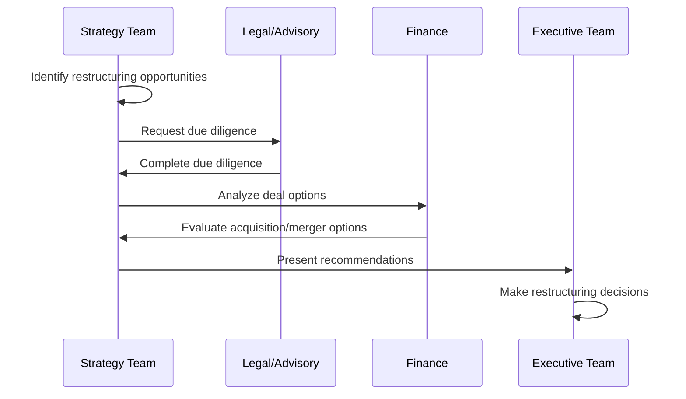
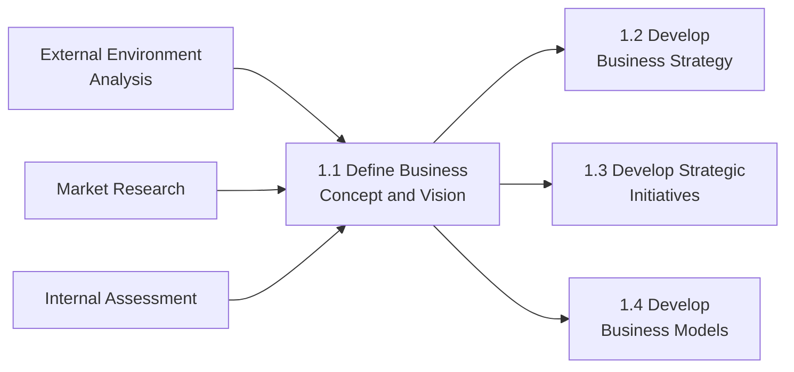

# Define the business concept and long-term vision

> Creating a conceptual framework of the organization's business activity and strategic vision with long-term applicability. Scout the organization's internal capabilities, as well as the customer's needs and desires, to identify a fit that can be used to advance a conceptual structure of the organization's business activity. Conduct analysis in light of relevant externalities and large-scale shifts in the market landscape.

## Overview

Define the business concept and long-term vision (APQC 1.1) is the first process group within the Vision and Strategy category. This process group encompasses all activities related to establishing the foundational business concept and creating a long-term strategic vision. It requires comprehensive analysis of both external market conditions and internal organizational capabilities to create a viable and sustainable business model.

The process involves systematic assessment of the external environment (including competitors, market trends, and regulatory factors), market research to understand customer needs, internal capability analysis, and ultimately the establishment of a strategic vision that aligns stakeholders around common objectives.

## Process Hierarchy



## Key Statistics

| Metric | Value |
|--------|-------|
| APQC Code | 17040 |
| Hierarchy ID | 1.1 |
| Level | Process Group |
| Category | [Develop Vision and Strategy](/processes/01-Strategy) |
| Sub-Processes | 5 |
| Activities | 25+ |

## Process Flow



## GraphDL Semantic Structure

```
define.BusinessConceptAndLongTermVision
```

| Component | Value | Description |
|-----------|-------|-------------|
| Verb | `define` | Primary action of establishing and articulating |
| Object | `BusinessConceptAndLongTermVision` | The conceptual framework and strategic direction |
| Preposition | - | Not applicable at process group level |
| PrepObject | - | Not applicable at process group level |

## Activities

### 1.1.1 - Assess the external environment

Assessing all forces, entities, and systems that are external to an organization but can affect its operation. Analyze far-reaching currents in the macroeconomic situation, assess the competition, evaluate technological changes, and identify societal as well as ecological issues of concern.



**Tasks:**
- `identify.Competitors` - Determine key competitors and their strategies
- `analyze.Competition` - Evaluate competitive forces and market position
- `identify.EconomicTrends` - Determine macroeconomic shifts relevant to organization
- `identify.PoliticalFactors` - Assess regulatory and policy environment
- `assess.NewTechnologies` - Evaluate technological developments and disruptions
- `analyze.Demographics` - Examine population characteristics and trends
- `identify.SocialChanges` - Distinguish cultural and societal shifts

### 1.1.2 - Survey market and determine customer needs and wants

Examining the market to identify customer required solutions. Assess the relevant market(s) to determine the products/services that are needed or wanted by customers.



**Tasks:**
- `conduct.QualitativeResearch` - Investigate market using qualitative measures
- `conduct.QuantitativeResearch` - Analyze market using quantitative methods
- `capture.CustomerNeeds` - Identify and collect customer requirements
- `assess.CustomerWants` - Create customer profiles and needs mapping

### 1.1.3 - Assess the internal environment

Undertaking a review of the organization's in-house skills and resources in order to create a big-picture understanding of internal capacities.



**Tasks:**
- `analyze.OrganizationalCharacteristics` - Examine key differentiating attributes
- `analyze.InternalOperations` - Measure effectiveness of operations
- `create.ProcessBaselines` - Establish performance standards
- `analyze.SystemsAndTechnology` - Evaluate deployed technology capabilities
- `analyze.FinancialHealth` - Appraise financial state
- `identify.CoreCompetencies` - Determine strategic capabilities

### 1.1.4 - Establish strategic vision

Establishing the organization's long-term vision as a strategic positioning and engagement of stakeholders.



**Tasks:**
- `define.StrategicVision` - Develop goals that define organization's vision
- `align.Stakeholders` - Orient entities around strategic vision
- `communicate.StrategicVision` - Convey alignment plan to stakeholders

### 1.1.5 - Conduct organization restructuring opportunities

Examining the scope and contingencies for restructuring based on market situation and internal realities.



**Tasks:**
- `identify.RestructuringOpportunities` - Analyze internal viability and external contingency
- `perform.DueDiligence` - Audit status of restructuring probabilities
- `analyze.DealOptions` - Examine options for organizational changes
- `evaluate.AcquisitionOptions` - Appraise potential acquisitions
- `evaluate.MergerOptions` - Assess merger possibilities
- `evaluate.DivestureOptions` - Evaluate divestment appropriateness

## RACI Matrix

| Activity | Responsible | Accountable | Consulted | Informed |
|----------|-------------|-------------|-----------|----------|
| Assess external environment | Strategy Team | Chief Strategy Officer | Marketing, Sales, R&D | Executive Team |
| Identify competitors | Market Research | CMO | Sales, Product | Strategy Team |
| Analyze competition | Competitive Intel | CSO | Business Units | Board |
| Survey market needs | Marketing | CMO | Sales, Customer Service | All Departments |
| Assess internal environment | Operations | COO | All Departments | Board |
| Analyze financial health | Finance | CFO | Strategy, Operations | Executive Team |
| Establish strategic vision | CEO | Board of Directors | Executive Team | All Employees |
| Align stakeholders | Strategy Team | CEO | Communications, HR | All Stakeholders |
| Evaluate restructuring | M&A Team | CEO | Legal, Finance | Board |

## Related Departments

- [Executive Office](/departments/Executive) - Primary accountability for vision establishment
- [Strategy & Planning](/departments/Strategy) - Analysis and vision development
- [Marketing](/departments/Marketing) - Market research and customer insights
- [Finance](/departments/Finance) - Financial analysis and health assessment
- [Legal](/departments/Legal) - Due diligence and restructuring support
- [Human Resources](/departments/HR) - Organizational capability assessment

## Related Occupations

- [Chief Executive Officers](/occupations/ChiefExecutives) - Vision accountability and stakeholder alignment
- [Chief Strategy Officers](/occupations/StrategyOfficers) - Strategic analysis leadership
- [Market Research Analysts](/occupations/MarketResearchAnalysts) - Market and competitive analysis
- [Management Analysts](/occupations/ManagementAnalysts) - Internal assessment and consulting
- [Financial Analysts](/occupations/FinancialAnalysts) - Financial health analysis
- [Mergers & Acquisitions Specialists](/occupations/MASpecialists) - Restructuring evaluation

## Industry Variations

### Banking

In banking, defining the business concept emphasizes regulatory compliance, digital transformation strategy, and risk management frameworks. The long-term vision must account for fintech disruption and evolving customer expectations for digital services.

**Industry-Specific Activities:**
- Define digital banking transformation roadmap
- Assess regulatory environment and compliance requirements
- Evaluate fintech partnership and acquisition opportunities
- Analyze interest rate environment impact on business model

### Education

Educational institutions focus on defining their district context and long-term academic vision. This includes analyzing competition from surrounding districts, private/charter schools, and virtual learning alternatives.

**Industry-Specific Activities:**
- Define district context and educational mission
- Assess competition from alternative education providers
- Analyze demographic trends affecting enrollment
- Evaluate technology integration strategies

### City Government

City governments define their comprehensive plans as their business concept, focusing on citizen services, infrastructure development, and community well-being rather than profit-driven objectives.

**Industry-Specific Activities:**
- Define city comprehensive plan and community vision
- Assess regional competition for residents and businesses
- Analyze demographic and economic development trends
- Evaluate public-private partnership opportunities

### Healthcare Provider

Healthcare organizations focus on quality of care, population health management, and the transition to value-based care models in their long-term vision development.

**Industry-Specific Activities:**
- Define care delivery model and quality objectives
- Assess competitive landscape of healthcare providers
- Analyze healthcare policy and reimbursement trends
- Evaluate technology and telehealth integration

### Aerospace and Defense

Aerospace and defense companies require extended planning horizons (10-20 years) due to long product development cycles and government contracting requirements.

**Industry-Specific Activities:**
- Define technology roadmap and capability development
- Assess competitor positioning in defense contracts
- Analyze defense budget and procurement trends
- Evaluate international market opportunities

## Sub-Processes

| Process | Code | Description |
|---------|------|-------------|
| [Assess the external environment](./AssessExternalEnvironment) | 1.1.1 | Analyzing external forces affecting the organization |
| [Survey market and determine customer needs](./SurveyMarket) | 1.1.2 | Examining market for customer solutions |
| [Assess the internal environment](./AssessInternalEnvironment) | 1.1.3 | Reviewing organizational capabilities |
| [Establish strategic vision](./EstablishVision) | 1.1.4 | Creating long-term strategic positioning |
| [Conduct restructuring opportunities](./Restructuring) | 1.1.5 | Evaluating organizational restructuring |

## Related Processes



## Metrics & KPIs

| Metric | Description | Target |
|--------|-------------|--------|
| Vision Clarity Score | Stakeholder understanding of business concept | >85% |
| Environmental Scan Coverage | Completeness of external analysis | >90% |
| Competitive Intelligence Accuracy | Accuracy of competitor assessments | >80% |
| Internal Assessment Depth | Coverage of organizational capabilities | >90% |
| Stakeholder Alignment Rate | Agreement with strategic vision | >80% |
| Time to Vision Approval | Duration from analysis to board approval | <90 days |

---

*Source: APQC PCF 17040 (1.1) - Cross-Industry*
