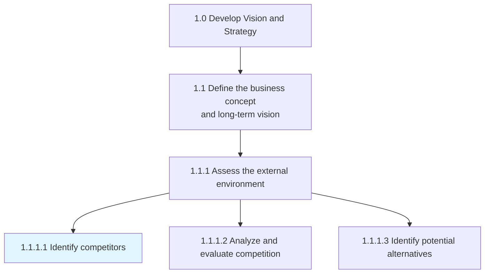
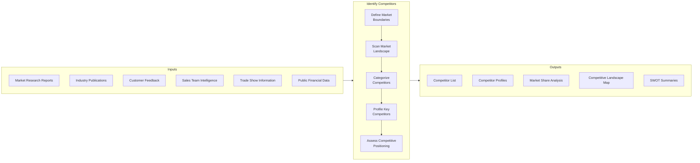
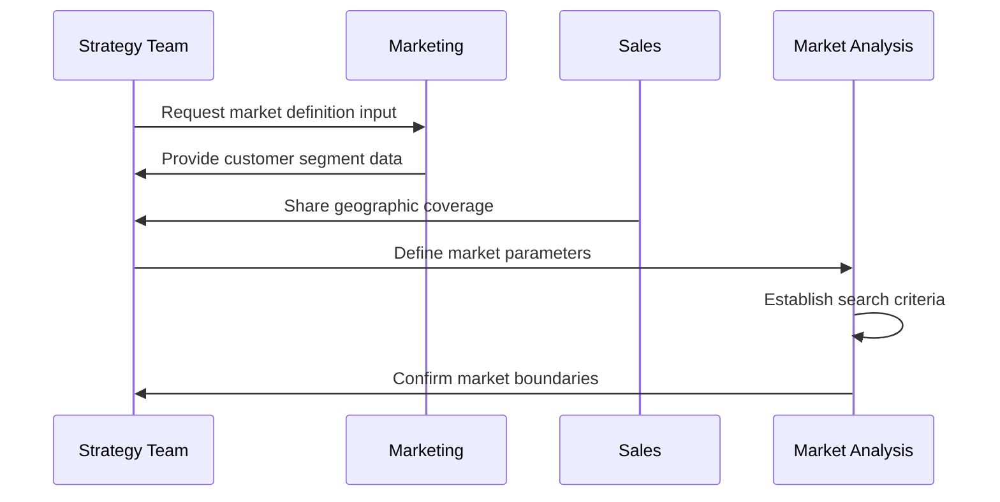
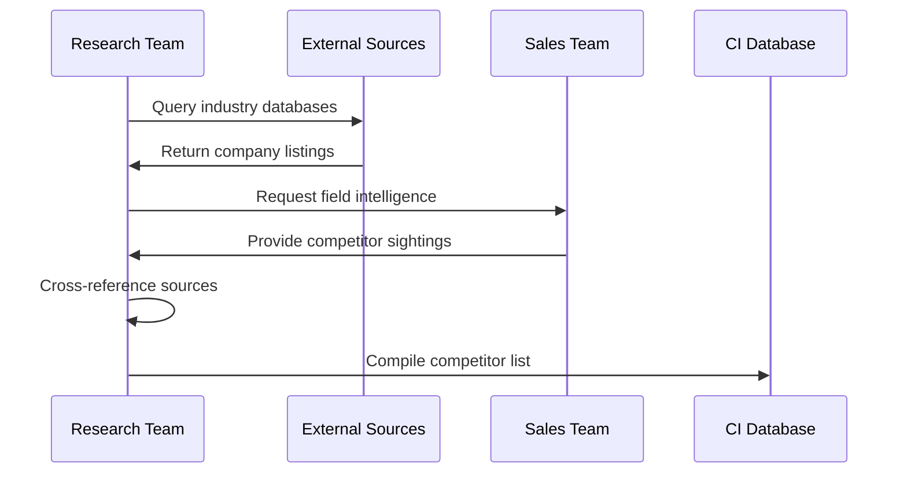
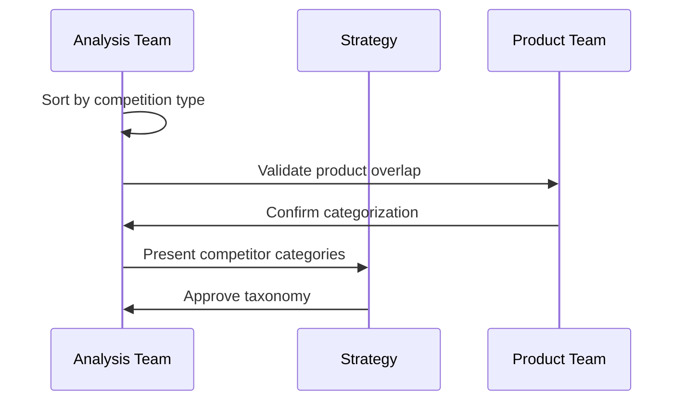
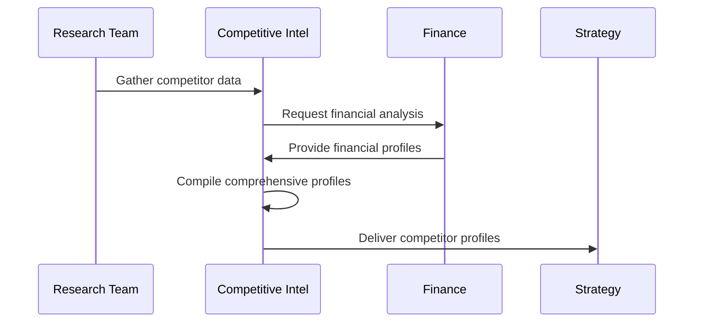
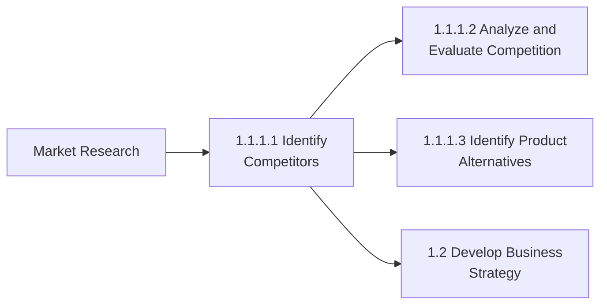

# Identify competitors

> Identifying your competitors, their service and/or product. Evaluating competitors strategies to determine their strengths and weaknesses relative to those of your own product or service.

## Overview

Identify competitors (APQC 1.1.1.1) is an activity within the "Assess the external environment" process. This fundamental strategic activity involves systematically discovering and cataloging organizations that compete for the same customers, market share, or resources. The process goes beyond simply listing competitors to include understanding their product/service offerings, market positioning, strategic approaches, and relative strengths and weaknesses.

Effective competitor identification forms the foundation for all subsequent competitive analysis and strategic planning activities. It requires a structured approach to scanning the market landscape, categorizing different types of competitors (direct, indirect, potential), and maintaining an up-to-date competitive intelligence database.

## Process Hierarchy



## Key Statistics

| Metric | Value |
|--------|-------|
| APQC Code | 19945 |
| Hierarchy ID | 1.1.1.1 |
| Level | Activity |
| Category | [Develop Vision and Strategy](/processes/01-Strategy) |
| Parent Process | [Define business concept and long-term vision](./BusinessConcept.mdx) |

## Process Flow



## GraphDL Semantic Structure

```
identify.Competitors
```

| Component | Value | Description |
|-----------|-------|-------------|
| Verb | `identify` | Primary action of discovering and cataloging |
| Object | `Competitors` | Organizations competing in the same market |
| Preposition | - | Not applicable |
| PrepObject | - | Not applicable |

## Activities

### Define Market Boundaries

Establishing the scope and parameters for competitor identification by defining the relevant market, customer segments, and geographic boundaries.



**Tasks:**
- `define.MarketScope` - Establish relevant market definition
- `identify.CustomerSegments` - Determine target customer groups
- `establish.GeographicBoundaries` - Define geographic scope of competition

### Scan Market Landscape

Systematically searching for and identifying all organizations that compete in the defined market space.



**Tasks:**
- `search.IndustryDatabases` - Query commercial and public databases
- `review.IndustryPublications` - Analyze trade press and reports
- `gather.SalesIntelligence` - Collect field observations from sales team
- `monitor.TradeEvents` - Track competitors at industry events

### Categorize Competitors

Classifying identified competitors into meaningful categories based on their relationship to the organization.



**Tasks:**
- `classify.DirectCompetitors` - Identify head-to-head competitors
- `classify.IndirectCompetitors` - Identify substitute providers
- `classify.PotentialCompetitors` - Identify emerging threats
- `classify.PeripheralCompetitors` - Identify adjacent market players

### Profile Key Competitors

Creating detailed profiles of the most significant competitors including their offerings, strategies, and capabilities.



**Tasks:**
- `document.ProductOfferings` - Catalog competitor products/services
- `analyze.PricingStrategies` - Assess competitor pricing approaches
- `assess.MarketPositioning` - Evaluate competitor brand positioning
- `evaluate.StrengthsWeaknesses` - Determine relative advantages/disadvantages

## RACI Matrix

| Activity | Responsible | Accountable | Consulted | Informed |
|----------|-------------|-------------|-----------|----------|
| Define market boundaries | Strategy Team | Chief Strategy Officer | Marketing, Sales | Product Team |
| Scan market landscape | Competitive Intelligence | Strategy Director | All Business Units | Executive Team |
| Categorize competitors | Market Research | Marketing Director | Product, Sales | Strategy Team |
| Profile key competitors | Competitive Intelligence | CSO | Finance, Product | Executive Team |
| Assess competitive positioning | Strategy Team | CEO | All Departments | Board |

## Related Departments

- [Strategy & Planning](/departments/Strategy) - Overall competitive analysis coordination
- [Marketing](/departments/Marketing) - Market research and competitor monitoring
- [Sales](/departments/Sales) - Field intelligence and competitor encounters
- [Product Management](/departments/Product) - Product comparison and positioning
- [Finance](/departments/Finance) - Competitor financial analysis

## Related Occupations

- [Market Research Analysts](/occupations/MarketResearchAnalysts) - Primary competitor research
- [Competitive Intelligence Analysts](/occupations/CompetitiveIntelligence) - Systematic competitor monitoring
- [Business Development Managers](/occupations/BusinessDevelopment) - Market insights from deals
- [Sales Representatives](/occupations/SalesRepresentatives) - Field-level competitor observations
- [Product Managers](/occupations/ProductManagers) - Product-level competitive assessment

## Industry Variations

### Aerospace and Defense

Competitor identification in aerospace and defense focuses on companies competing for government contracts, prime contractor relationships, and technology leadership in specific defense segments.

**Industry-Specific Activities:**
- Identify competitors by defense program participation
- Track competitor contract wins and losses
- Monitor defense budget allocation impacts
- Assess international defense company expansion

### Airline

Airlines identify competitors based on route overlap, hub competition, and fare class positioning. Low-cost carriers and premium airlines may compete differently across segments.

**Industry-Specific Activities:**
- Map competitor route networks
- Track competitor capacity and frequency
- Monitor airline alliance membership
- Assess codeshare and partnership impacts

### Automotive

Automotive competitor identification spans vehicle manufacturers, segments, and increasingly, technology/mobility providers entering the automotive space.

**Industry-Specific Activities:**
- Identify competitors by vehicle segment
- Track new entrant electric vehicle manufacturers
- Monitor mobility service competitors
- Assess technology company automotive initiatives

### Banking

Banks identify competitors across traditional institutions, fintech disruptors, and non-bank financial services providers that may compete for specific product categories.

**Industry-Specific Activities:**
- Identify competitors by product line (deposits, lending, etc.)
- Track fintech startup emergence
- Monitor big tech financial services moves
- Assess credit union and community bank competition

### Broadcasting

Broadcasters compete with traditional networks, streaming services, and digital content platforms for audience attention and advertising revenue.

**Industry-Specific Activities:**
- Identify streaming service competitors
- Track social media platform competition
- Monitor digital advertising competitors
- Assess content producer vertical integration

### City Government

City governments compete with other municipalities for residents, businesses, economic development, and talent attraction.

**Industry-Specific Activities:**
- Identify competing municipalities for economic development
- Track regional competition for residents
- Monitor competitor city incentive programs
- Assess regional talent pool competition

### Education

Educational institutions compete with surrounding districts, private schools, charter schools, and increasingly, virtual learning alternatives.

**Industry-Specific Activities:**
- Identify competing school districts
- Track private and charter school options
- Monitor virtual/online learning competitors
- Assess homeschool movement impact

### Healthcare Provider

Healthcare organizations identify competitors among hospitals, health systems, ambulatory care centers, and virtual care providers.

**Industry-Specific Activities:**
- Identify competing health systems
- Track ambulatory surgery center competition
- Monitor telehealth provider emergence
- Assess retail clinic expansion

## Sub-Processes

| Process | Code | Description |
|---------|------|-------------|
| Define market scope | - | Establish relevant competitive market |
| Scan competitive landscape | - | Systematic competitor discovery |
| Categorize competitors | - | Classify by competition type |
| Profile competitors | - | Create detailed competitor assessments |

## Related Processes



## Metrics & KPIs

| Metric | Description | Target |
|--------|-------------|--------|
| Competitor Coverage | Percentage of market competitors identified | >95% |
| Profile Completeness | Completeness of competitor profiles | >85% |
| Intelligence Currency | Freshness of competitor information | <90 days |
| Categorization Accuracy | Correct classification of competitor types | >90% |
| Source Diversity | Number of unique intelligence sources used | >10 |
| Time to Detection | Speed of identifying new market entrants | <30 days |

---

*Source: APQC PCF 19945 (1.1.1.1) - Cross-Industry*
