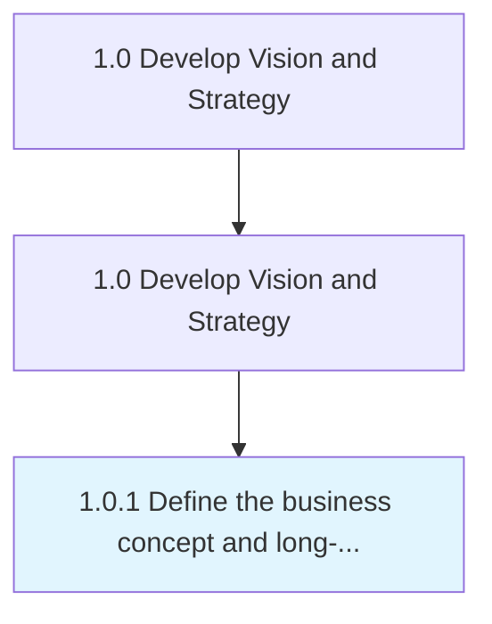

# Define the business concept and long-term vision

> Creating a conceptual framework of the organization's business activity and strategic vision with long-term applicability.

## Overview

Process 1.0.1 is a core process that defines the specific procedures for define the business concept and long-term vision. 

Creating a conceptual framework of the organization's business activity and strategic vision with long-term applicability. Scout the organization's internal capabilities, as well as the customer's needs and desires, to identify a fit that can be used to advance a conceptual structure of the organization's business activity. Conduct analysis in light of relevant externalities and large-scale shifts in the market landscape.

## Process Hierarchy



## Key Statistics

| Metric | Value |
|--------|-------|
| APQC Code | 17040 |
| Hierarchy ID | 1.0.1 |
| Level | Process |
| Parent | [1.0](../) |
| Sub-Processes | 0 |


## GraphDL Semantic Structure

```
define.TheBusinessConceptAndLongtermVision
```

| Component | Value | Description |
|-----------|-------|-------------|
| Verb | `define` | Primary action |
| Object | `the business concept and long-term vision` | Direct object |


---

*Source: APQC PCF 17040 (1.0.1) - APQC*
