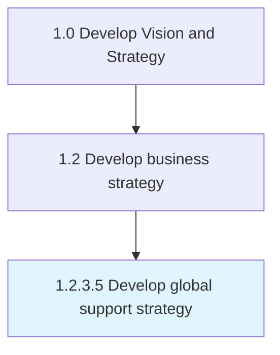

# Develop global support strategy

> Developing a plan to deploy support services and support functions throughout the organization globally.

## Overview

Activity 1.2.3.5 is an activity within the Develop Vision and Strategy framework. 

Developing a plan to deploy support services and support functions throughout the organization globally. Arrange the organizations functional support areas to create efficiencies of scale in the delivery of support services, globally.

## Process Hierarchy



## Key Statistics

| Metric | Value |
|--------|-------|
| APQC Code | 19950 |
| Hierarchy ID | 1.2.3.5 |
| Level | Activity |
| Parent | [1.2.3](../) |
| Sub-Processes | 0 |


## GraphDL Semantic Structure

```
develop.GlobalSupportStrategy
```

| Component | Value | Description |
|-----------|-------|-------------|
| Verb | `develop` | Primary action |
| Object | `global support strategy` | Direct object |


## Related Concepts

- GlobalSupportStrategy


---

*Source: APQC PCF 19950 (1.2.3.5) - APQC*
