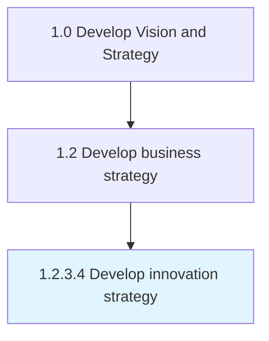

# Develop innovation strategy

> Developing a plan and vision to encourage advancements in technology or product/services.

## Overview

Activity 1.2.3.4 is an activity within the Develop Vision and Strategy framework. 

Developing a plan and vision to encourage advancements in technology or product/services. Create a roadmap for changing or innovating the business model to make business operations more competitive. Set up new R&D services for changing or bringing new value propositions, services, production processes, and invention of technology not previously used by competitors etc.

## Process Hierarchy



## Key Statistics

| Metric | Value |
|--------|-------|
| APQC Code | 19952 |
| Hierarchy ID | 1.2.3.4 |
| Level | Activity |
| Parent | [1.2.3](../) |
| Sub-Processes | 0 |


## GraphDL Semantic Structure

```
develop.InnovationStrategy
```

| Component | Value | Description |
|-----------|-------|-------------|
| Verb | `develop` | Primary action |
| Object | `innovation strategy` | Direct object |


## Related Concepts

- InnovationStrategy


---

*Source: APQC PCF 19952 (1.2.3.4) - APQC*
