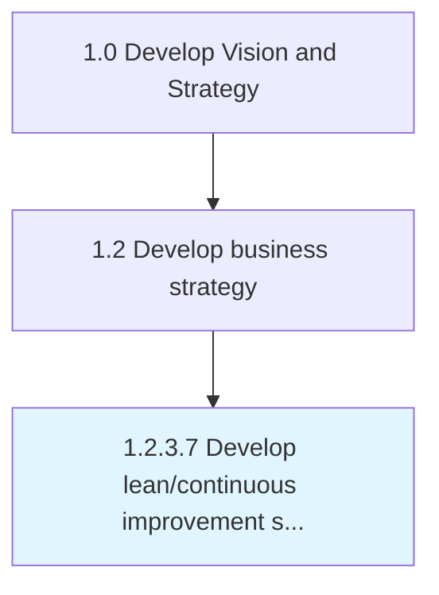

# Develop lean/continuous improvement strategy

> Developing strategies for the optimization of processes and the improvement of functional areas in order to improve the bottom line.

## Overview

Activity 1.2.3.7 is an activity within the Develop Vision and Strategy framework. 

Developing strategies for the optimization of processes and the improvement of functional areas in order to improve the bottom line. Create a road map of decision choices that would allow the organization to continuously enhance process efficiencies and advance performance standards.

## Process Hierarchy



## Key Statistics

| Metric | Value |
|--------|-------|
| APQC Code | 14197 |
| Hierarchy ID | 1.2.3.7 |
| Level | Activity |
| Parent | [1.2.3](../) |
| Sub-Processes | 0 |


## GraphDL Semantic Structure

```
develop.LeancontinuousImprovementStrategy
```

| Component | Value | Description |
|-----------|-------|-------------|
| Verb | `develop` | Primary action |
| Object | `lean/continuous improvement strategy` | Direct object |


## Related Concepts

- [LeanImprovementStrategy](/concepts/LeanImprovementStrategy)
- [ContinuousImprovementStrategy](/concepts/ContinuousImprovementStrategy)


---

*Source: APQC PCF 14197 (1.2.3.7) - APQC*
