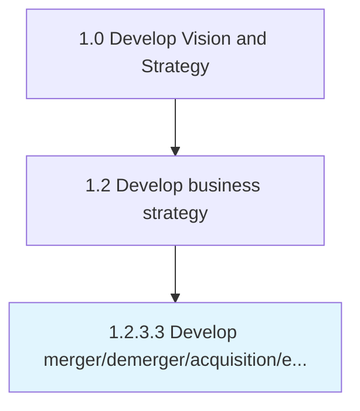

# Develop merger/demerger/acquisition/exit strategy

> Defining a strategy for corporate development.

## Overview

Activity 1.2.3.3 is an activity within the Develop Vision and Strategy framework. 

Defining a strategy for corporate development. Include providing a framework for evaluating merger and acquisition candidates; and planning for a value creation through merging/demerging with a company, acquiring a company, or exiting from an already merged/acquired company.

## Process Hierarchy



## Key Statistics

| Metric | Value |
|--------|-------|
| APQC Code | 16805 |
| Hierarchy ID | 1.2.3.3 |
| Level | Activity |
| Parent | [1.2.3](../) |
| Sub-Processes | 0 |


## GraphDL Semantic Structure

```
develop.MergerdemergeracquisitionexitStrategy
```

| Component | Value | Description |
|-----------|-------|-------------|
| Verb | `develop` | Primary action |
| Object | `merger/demerger/acquisition/exit strategy` | Direct object |


## Related Concepts

- [MergerStrategy](/concepts/MergerStrategy)
- [DemergerStrategy](/concepts/DemergerStrategy)
- [AcquisitionStrategy](/concepts/AcquisitionStrategy)
- [ExitStrategy](/concepts/ExitStrategy)


---

*Source: APQC PCF 16805 (1.2.3.3) - APQC*
