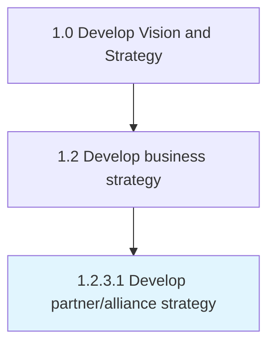

# Develop partner/alliance strategy

> Defining direction and plan objectives for partnering with other companies to deliver product/services.

## Overview

Activity 1.2.3.1 is an activity within the Develop Vision and Strategy framework. 

Defining direction and plan objectives for partnering with other companies to deliver product/services. Focus on creating a vision and strategic objectives and culminate in creating measures for the strategic alliance or partnership.

## Process Hierarchy



## Key Statistics

| Metric | Value |
|--------|-------|
| APQC Code | 16803 |
| Hierarchy ID | 1.2.3.1 |
| Level | Activity |
| Parent | [1.2.3](../) |
| Sub-Processes | 0 |


## GraphDL Semantic Structure

```
develop.PartnerallianceStrategy
```

| Component | Value | Description |
|-----------|-------|-------------|
| Verb | `develop` | Primary action |
| Object | `partner/alliance strategy` | Direct object |


## Related Concepts

- [PartnerStrategy](/concepts/PartnerStrategy)
- [AllianceStrategy](/concepts/AllianceStrategy)


---

*Source: APQC PCF 16803 (1.2.3.1) - APQC*
