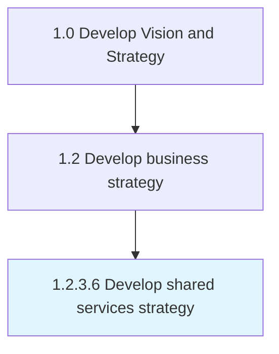

# Develop shared services strategy

> Charting a plan to leverage internal services and support functions throughout the organization.

## Overview

Activity 1.2.3.6 is an activity within the Develop Vision and Strategy framework. 

Charting a plan to leverage internal services and support functions throughout the organization. Delineate a framework of parameters and criteria to selectively filter service areas for inclusion among the organizations common resources. Arrange the organizations functional areas to create efficiencies of scale in the delivery of internal services.

## Process Hierarchy



## Key Statistics

| Metric | Value |
|--------|-------|
| APQC Code | 19951 |
| Hierarchy ID | 1.2.3.6 |
| Level | Activity |
| Parent | [1.2.3](../) |
| Sub-Processes | 0 |


## GraphDL Semantic Structure

```
develop.SharedServicesStrategy
```

| Component | Value | Description |
|-----------|-------|-------------|
| Verb | `develop` | Primary action |
| Object | `shared services strategy` | Direct object |


## Related Concepts

- SharedServicesStrategy


---

*Source: APQC PCF 19951 (1.2.3.6) - APQC*
