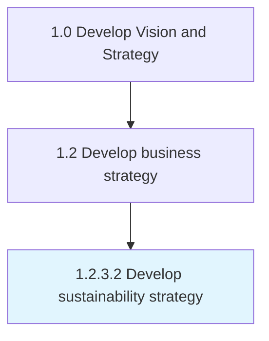

# Develop sustainability strategy

> Formulating strategic options that create opportunities for the sustenance and prosperity of the business in the long run.

## Overview

Activity 1.2.3.2 is an activity within the Develop Vision and Strategy framework. 

Formulating strategic options that create opportunities for the sustenance and prosperity of the business in the long run. Go beyond business longevity to consider alternate strategies that allow the organizations preservation of vitality over time. Earmark resources and target processes, the former of which are dedicated to the absorption of sustainable practices in the latter.

## Process Hierarchy



## Key Statistics

| Metric | Value |
|--------|-------|
| APQC Code | 14189 |
| Hierarchy ID | 1.2.3.2 |
| Level | Activity |
| Parent | [1.2.3](../) |
| Sub-Processes | 0 |


## GraphDL Semantic Structure

```
develop.SustainabilityStrategy
```

| Component | Value | Description |
|-----------|-------|-------------|
| Verb | `develop` | Primary action |
| Object | `sustainability strategy` | Direct object |


## Related Concepts

- [SustainabilityStrategy](/concepts/SustainabilityStrategy)


---

*Source: APQC PCF 14189 (1.2.3.2) - APQC*
