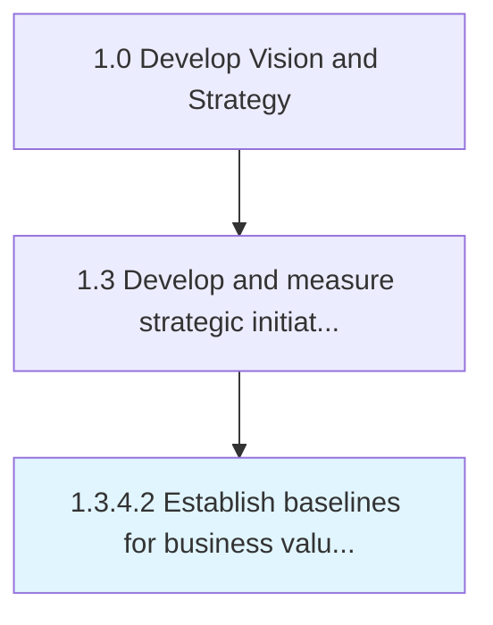

# Establish baselines for business value drivers

> Establishing baseline measures that provide standards for assessing performance of Identify business value drivers [19982].

## Overview

Activity 1.3.4.2 is an activity within the Develop Vision and Strategy framework. 

Establishing baseline measures that provide standards for assessing performance of Identify business value drivers [19982].

## Process Hierarchy



## Key Statistics

| Metric | Value |
|--------|-------|
| APQC Code | 19983 |
| Hierarchy ID | 1.3.4.2 |
| Level | Activity |
| Parent | [1.3.4](../) |
| Sub-Processes | 0 |


## GraphDL Semantic Structure

```
establish.Baselines.for.BusinessValueDrivers
```

| Component | Value | Description |
|-----------|-------|-------------|
| Verb | `establish` | Primary action |
| Object | `baselines` | Direct object |
| Preposition | `for` | Relationship |
| PrepObject | `business value drivers` | Indirect object |


## Related Concepts

- [Baselines](/concepts/Baselines)
- [BusinessValueDrivers](/concepts/BusinessValueDrivers)


---

*Source: APQC PCF 19983 (1.3.4.2) - APQC*
