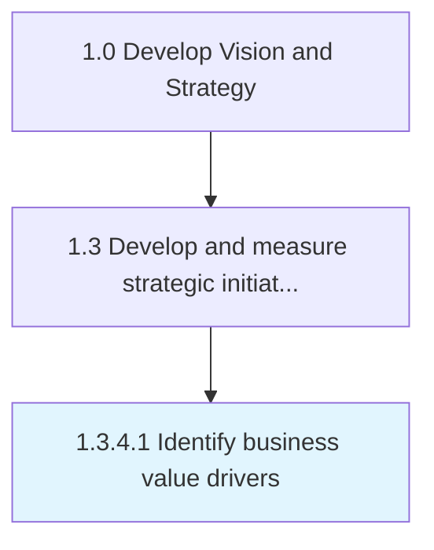

# Identify business value drivers

> Determining key indicators or factors responsible for driving business value.

## Overview

Activity 1.3.4.1 is an activity within the Develop Vision and Strategy framework. 

Determining key indicators or factors responsible for driving business value. Key business value drivers comprise of operational, financial, and sustainability drivers.

## Process Hierarchy



## Key Statistics

| Metric | Value |
|--------|-------|
| APQC Code | 19982 |
| Hierarchy ID | 1.3.4.1 |
| Level | Activity |
| Parent | [1.3.4](../) |
| Sub-Processes | 0 |


## GraphDL Semantic Structure

```
identify.BusinessValueDrivers
```

| Component | Value | Description |
|-----------|-------|-------------|
| Verb | `identify` | Primary action |
| Object | `business value drivers` | Direct object |


## Related Concepts

- BusinessValueDrivers


---

*Source: APQC PCF 19982 (1.3.4.1) - APQC*
