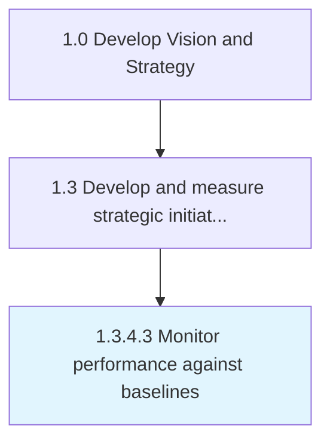

# Monitor performance against baselines

> Overseeing the progress of activities to ensure they are on-course and on-schedule in meeting the objectives and performance targets against Establish baselines for business value drivers [19983].

## Overview

Activity 1.3.4.3 is an activity within the Develop Vision and Strategy framework. 

Overseeing the progress of activities to ensure they are on-course and on-schedule in meeting the objectives and performance targets against Establish baselines for business value drivers [19983].

## Process Hierarchy



## Key Statistics

| Metric | Value |
|--------|-------|
| APQC Code | 19984 |
| Hierarchy ID | 1.3.4.3 |
| Level | Activity |
| Parent | [1.3.4](../) |
| Sub-Processes | 0 |


## GraphDL Semantic Structure

```
monitor.Performance.against.Baselines
```

| Component | Value | Description |
|-----------|-------|-------------|
| Verb | `monitor` | Primary action |
| Object | `performance` | Direct object |
| Preposition | `against` | Relationship |
| PrepObject | `baselines` | Indirect object |


## Related Concepts

- Performance
- Baselines


---

*Source: APQC PCF 19984 (1.3.4.3) - APQC*
