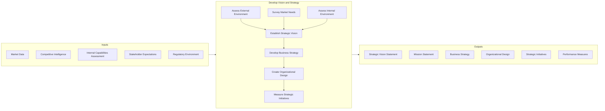
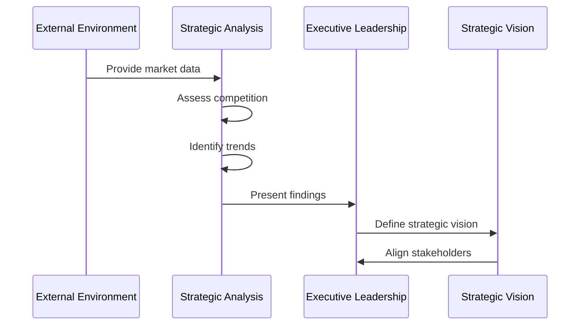
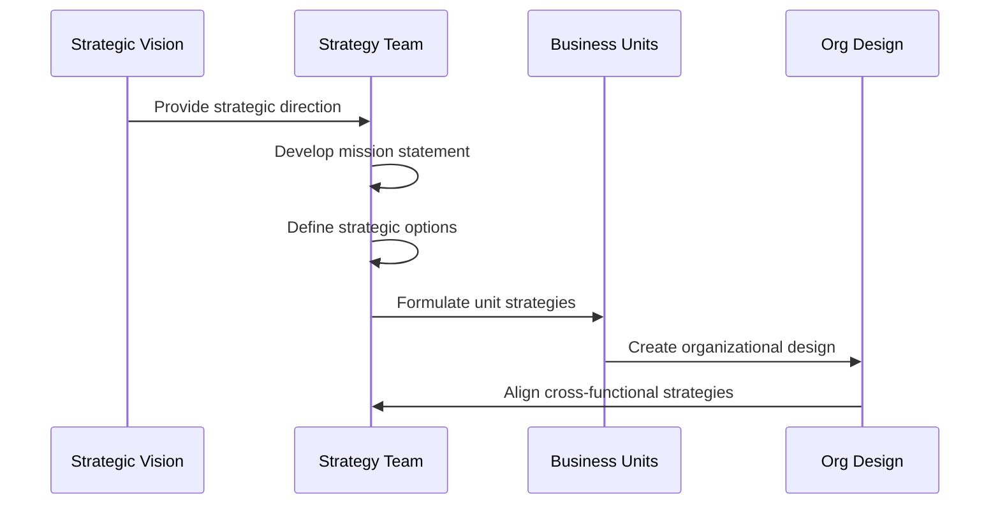
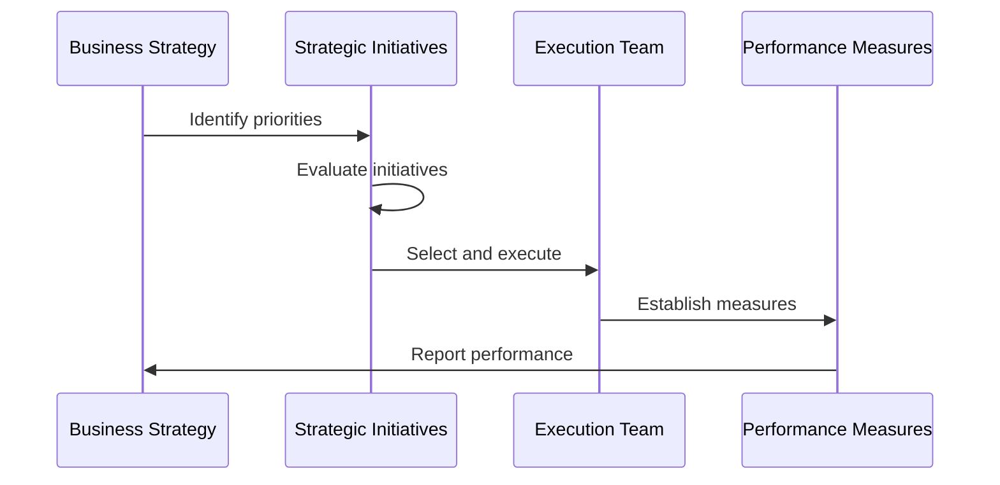
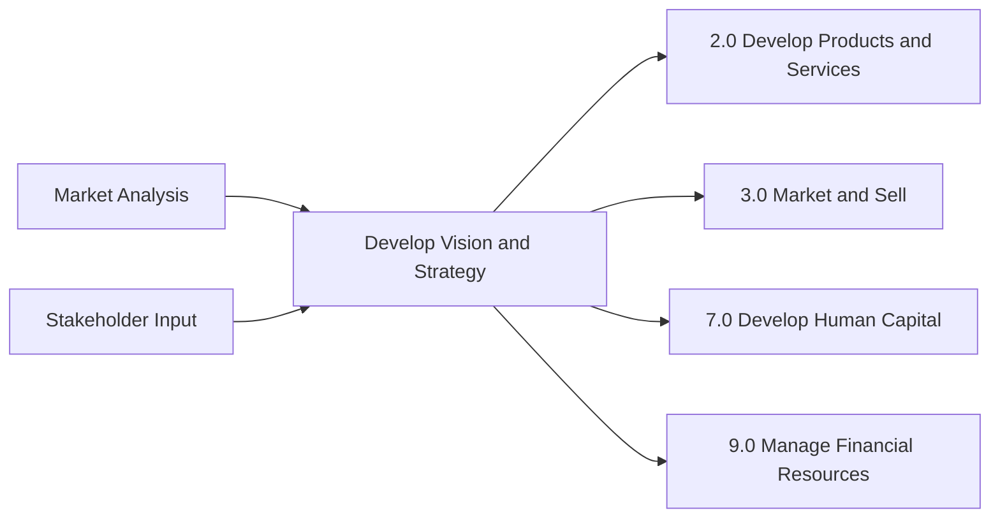

# Develop Vision and Strategy

> Establishing a direction and vision for an organization. This involves defining the business concept and long-term vision, as well as developing the business strategy and managing strategic initiatives. Processes in this category focus on creating a vision, a mission, and strategic objectives, and culminate in creating measures to ensure that the organization is moving in the desired direction.

## Overview

Develop Vision and Strategy is the foundational APQC Process Classification Framework category (1.0) that encompasses all activities related to establishing organizational direction. This category provides the strategic foundation upon which all other business processes operate. It includes defining the business concept, assessing internal and external environments, establishing strategic vision, developing business strategy, and measuring strategic initiatives.

Organizations use these processes to align their resources, capabilities, and operations toward a common set of objectives. The processes within this category ensure that leadership has a clear understanding of market conditions, competitive landscape, and internal capabilities before charting the organization's future course.

## Process Hierarchy

```mermaid
graph TD
    C1["1.0 Develop Vision and Strategy"] --> G11["1.1 Define the business concept and long-term vision"]
    C1 --> G12["1.2 Develop business strategy"]
    C1 --> G13["1.3 Develop and measure strategic initiatives"]
    C1 --> G14["1.4 Develop and maintain business models"]

    G11 --> P111["1.1.1 Assess the external environment"]
    G11 --> P112["1.1.2 Survey market and determine customer needs"]
    G11 --> P113["1.1.3 Assess the internal environment"]
    G11 --> P114["1.1.4 Establish strategic vision"]
    G11 --> P115["1.1.5 Conduct organization restructuring opportunities"]

    G12 --> P121["1.2.1 Develop overall mission statement"]
    G12 --> P122["1.2.2 Define and evaluate strategic options"]
    G12 --> P123["1.2.3 Set/Develop long-term enterprise strategy"]
    G12 --> P124["1.2.4 Coordinate cross-functional strategies"]
    G12 --> P125["1.2.5 Create organizational design"]
    G12 --> P126["1.2.6 Develop organizational objectives"]
    G12 --> P127["1.2.7 Formulate business unit strategies"]
    G12 --> P128["1.2.8 Develop customer experience strategy"]
```



## Key Statistics

| Metric | Value |
|--------|-------|
| APQC Code | 10002 |
| Hierarchy ID | 1.0 |
| Level | Category |
| Category | [Develop Vision and Strategy](/processes/01-Strategy) |
| Process Groups | 4 |
| Total Sub-Processes | 100+ |

## Process Flow



## GraphDL Semantic Structure

```
develop.VisionAndStrategy
```

| Component | Value | Description |
|-----------|-------|-------------|
| Verb | `develop` | Primary action of creating and establishing |
| Object | `VisionAndStrategy` | The organizational direction and plan |
| Preposition | - | Not applicable at category level |
| PrepObject | - | Not applicable at category level |

## Activities

### 1.1 - Define the business concept and long-term vision

Creating a conceptual framework of the organization's business activity and strategic vision with long-term applicability. Scout the organization's internal capabilities, as well as the customer's needs and desires, to identify a fit that can be used to advance a conceptual structure of the organization's business activity.



**Tasks:**
- `assess.ExternalEnvironment` - Analyze forces and entities external to the organization
- `survey.Market` - Examine market to identify customer needs
- `assess.InternalEnvironment` - Review in-house skills and resources
- `establish.StrategicVision` - Create long-term vision and stakeholder alignment

### 1.2 - Develop business strategy

Developing an organization's mission statement, strategy, and business design. Create a concise statement that clearly articulates the mission of the organization.



**Tasks:**
- `develop.MissionStatement` - Establish overarching mission statement
- `define.StrategicOptions` - Delineate strategic decision options
- `set.LongTermStrategy` - Develop strategy for long-term goals
- `create.OrganizationalDesign` - Formulate organizational structure

### 1.3 - Develop and measure strategic initiatives

Managing strategic initiatives from development through selection, execution, and evaluation.



**Tasks:**
- `develop.StrategicInitiatives` - Create strategic projects
- `evaluate.StrategicInitiatives` - Examine projects for applicability
- `select.StrategicInitiatives` - Choose relevant projects
- `establish.HighLevelMeasures` - Devise evaluation criteria

## RACI Matrix

| Activity | Responsible | Accountable | Consulted | Informed |
|----------|-------------|-------------|-----------|----------|
| Assess external environment | Strategy Team | Chief Strategy Officer | Marketing, Sales | All departments |
| Survey market needs | Marketing | CMO | Sales, Product | Executive team |
| Assess internal environment | Operations | COO | All departments | Board |
| Establish strategic vision | CEO | Board of Directors | Executive team | All employees |
| Develop business strategy | Strategy Team | CEO | Business unit heads | All departments |
| Create organizational design | HR, Strategy | COO | All departments | All employees |
| Measure strategic initiatives | PMO | CSO | Finance | Executive team |

## Related Departments

- [Executive Office](/departments/Executive) - Primary accountability for vision and strategy
- [Strategy & Planning](/departments/Strategy) - Development and analysis
- [Finance](/departments/Finance) - Financial analysis and resource allocation
- [Marketing](/departments/Marketing) - Market research and customer insights
- [Human Resources](/departments/HR) - Organizational design and capability assessment

## Related Occupations

- [Chief Executive Officers](/occupations/ChiefExecutives) - Ultimate accountability
- [General and Operations Managers](/occupations/GeneralManagers) - Strategy implementation
- [Market Research Analysts](/occupations/MarketResearchAnalysts) - Market analysis
- [Management Analysts](/occupations/ManagementAnalysts) - Strategic consulting
- [Financial Analysts](/occupations/FinancialAnalysts) - Financial planning support

## Industry Variations

### Aerospace and Defense

In aerospace and defense, vision and strategy development emphasizes long-term planning horizons (10-20 years) due to extended product development cycles and government contracting requirements. Special focus on technology roadmaps and defense budget alignment.

**Industry-Specific Activities:**
- Model customer fleets and aircraft demand
- Align with defense budget cycles
- Plan for multi-decade technology development

### Banking

Banking institutions focus heavily on regulatory compliance, risk management, and digital transformation in their strategic planning. Vision development must account for evolving fintech landscape and changing customer expectations.

**Industry-Specific Activities:**
- Assess regulatory environment changes
- Develop digital banking strategy
- Plan for fintech disruption

### Healthcare Provider

Healthcare strategy development emphasizes quality of care metrics, regulatory compliance (HIPAA, etc.), and population health management. Vision often includes community health impact.

**Industry-Specific Activities:**
- Assess healthcare policy changes
- Develop population health strategies
- Plan for value-based care transition

## Sub-Processes

| Process | Code | Description |
|---------|------|-------------|
| [Define the business concept and long-term vision](./DefineTheBusinessConceptAndLongTermVision) | 1.1 | Creating conceptual framework for business activity |
| [Develop business strategy](./DevelopBusinessStrategy) | 1.2 | Developing mission, strategy, and business design |
| [Develop and measure strategic initiatives](./DevelopAndMeasureStrategicInitiatives) | 1.3 | Managing strategic projects from development to evaluation |
| [Develop and maintain business models](./DevelopAndMaintainBusinessModels) | 1.4 | Establishing how organization creates and captures value |

## Related Processes



## Metrics & KPIs

| Metric | Description | Target |
|--------|-------------|--------|
| Strategy Execution Rate | Percentage of strategic initiatives completed on time | >85% |
| Strategic Alignment Score | Employee understanding of strategic direction | >80% |
| Market Position | Relative competitive position improvement | Top quartile |
| Vision Clarity Index | Stakeholder clarity on organizational vision | >90% |
| Strategic Initiative ROI | Return on investment for strategic projects | >15% |

---

*Source: APQC PCF 10002 (1.0) - Cross-Industry*
