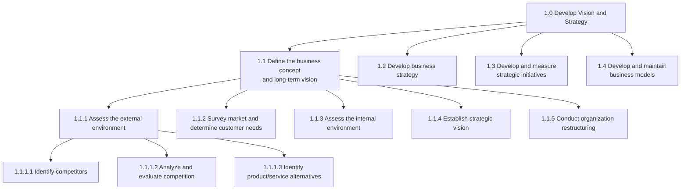
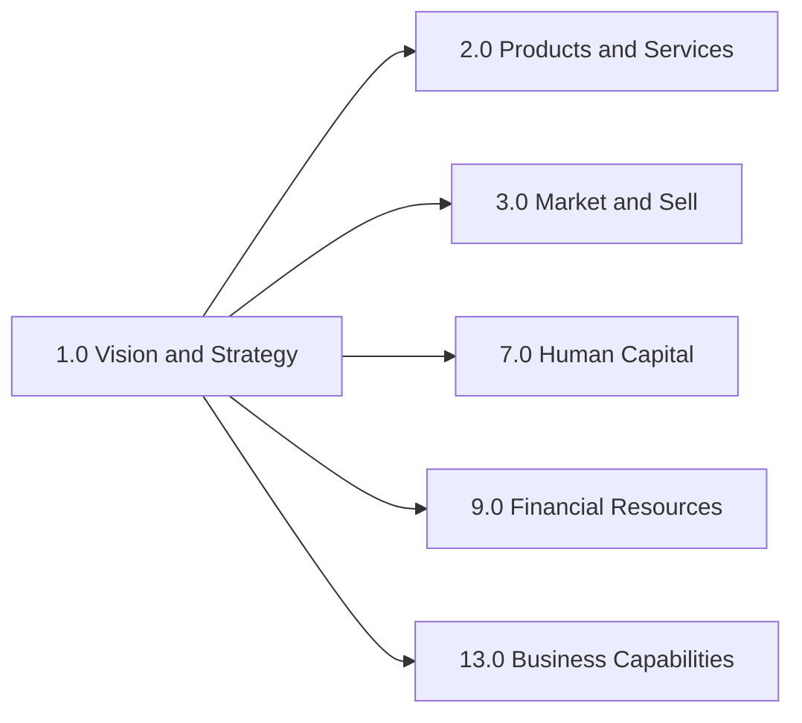

# Vision And Strategy

> Establishing a direction and vision for an organization. This involves defining the business concept and long-term vision, as well as developing the business strategy and managing strategic initiatives.

## Overview

APQC Category 1.0 - Develop Vision and Strategy is the foundational process category that encompasses all activities related to establishing organizational direction. This category provides the strategic foundation upon which all other business processes operate. Organizations use these processes to align their resources, capabilities, and operations toward a common set of objectives.

## Process Hierarchy

## Key Statistics

| Metric | Value |
|--------|-------|
| APQC Code | 10002 |
| Hierarchy ID | 1.0 |
| Level | Category |
| Process Groups | 4 |
| Total Processes | 100+ |

## Processes in this Category

### 1.1 Define the business concept and long-term vision

Creating a conceptual framework of the organization's business activity and strategic vision with long-term applicability.

- [Define the business concept and long-term vision](./BusinessConcept.mdx) - Process Group 1.1
- [Identify competitors](./Competitors.mdx) - Activity 1.1.1.1
- [Analyze and evaluate competition](./CompetitiveAnalysis.mdx) - Activity 1.1.1.2
- [Identify potential product or service alternatives](./Alternatives.mdx) - Activity 1.1.1.3

### 1.2 Develop business strategy

Developing an organization's mission statement, strategy, and business design.

### 1.3 Develop and measure strategic initiatives

Managing strategic initiatives from development through selection, execution, and evaluation.

### 1.4 Develop and maintain business models

Establishing how the organization creates and captures value.

## Related Categories

---

*Source: APQC PCF Category 1.0 - Cross-Industry*
