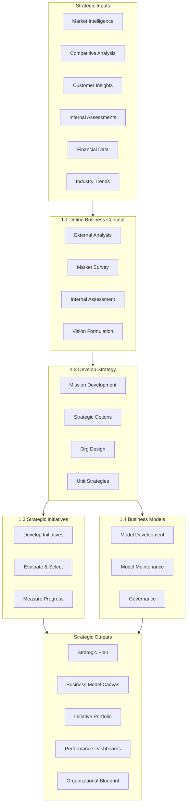
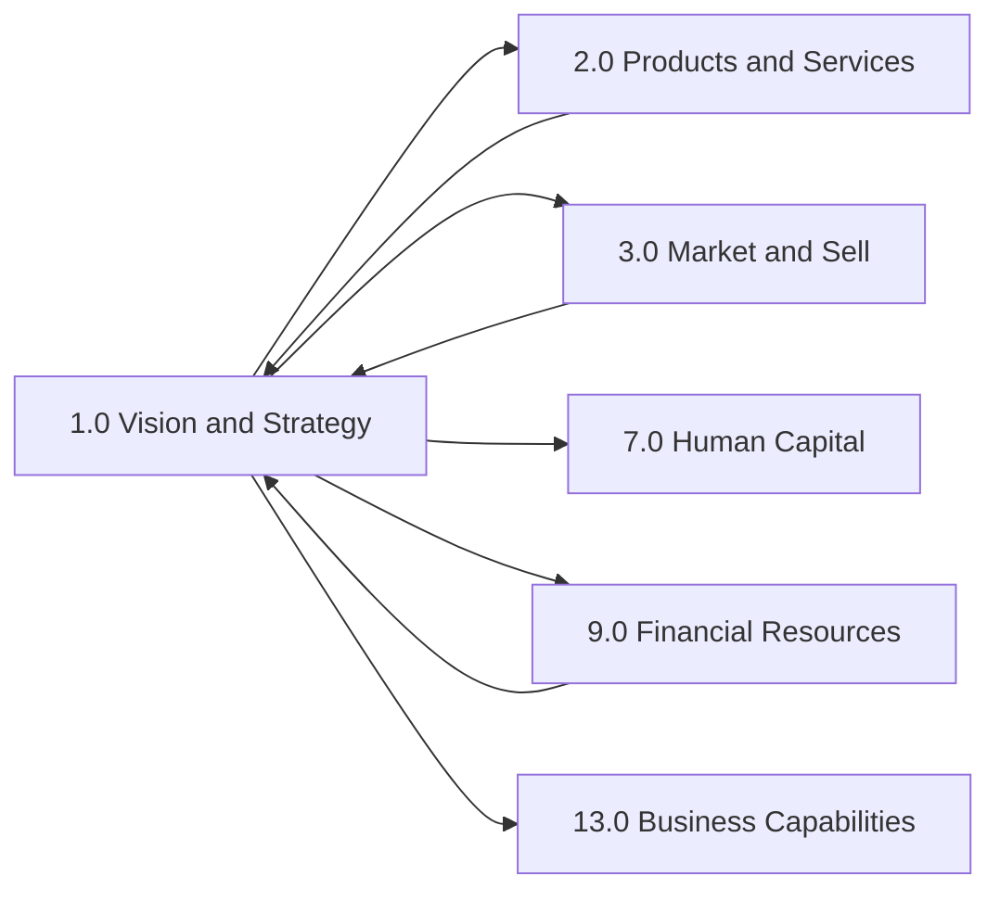

# Vision And Strategy

> Establishing a direction and vision for an organization. This involves defining the business concept and long-term vision, as well as developing the business strategy and managing strategic initiatives.

## Overview

APQC Category 1.0 - Develop Vision and Strategy is the foundational process category that encompasses all activities related to establishing organizational direction. This category provides the strategic foundation upon which all other business processes operate. Organizations use these processes to align their resources, capabilities, and operations toward a common set of objectives.

The processes within this category are essential for any organization seeking to compete effectively, adapt to market changes, and achieve sustainable growth. They range from environmental scanning and market research to vision formulation, strategy development, and business model innovation.

## Process Hierarchy

```mermaid
graph TD
    C1["1.0 Develop Vision and Strategy"] --> G11["1.1 Define the business concept<br/>and long-term vision"]
    C1 --> G12["1.2 Develop business strategy"]
    C1 --> G13["1.3 Develop and measure<br/>strategic initiatives"]
    C1 --> G14["1.4 Develop and maintain<br/>business models"]

    G11 --> P111["1.1.1 Assess the external environment"]
    G11 --> P112["1.1.2 Survey market and determine customer needs"]
    G11 --> P113["1.1.3 Assess the internal environment"]
    G11 --> P114["1.1.4 Establish strategic vision"]
    G11 --> P115["1.1.5 Conduct organization restructuring"]

    G12 --> P121["1.2.1 Develop overall mission statement"]
    G12 --> P122["1.2.2 Define and evaluate strategic options"]
    G12 --> P123["1.2.3 Select long-term strategy"]
    G12 --> P124["1.2.4 Coordinate and align strategies"]
    G12 --> P125["1.2.5 Create organizational design"]
    G12 --> P126["1.2.6 Develop organizational objectives"]
    G12 --> P127["1.2.7 Formulate business unit strategies"]
    G12 --> P128["1.2.8 Develop customer experience strategy"]

    G13 --> P131["1.3.1 Develop strategic initiatives"]
    G13 --> P132["1.3.2 Evaluate strategic initiatives"]
    G13 --> P133["1.3.3 Select strategic initiatives"]
    G13 --> P134["1.3.4 Measure strategic initiatives"]

    G14 --> P141["1.4.1 Develop business models"]
    G14 --> P142["1.4.2 Maintain business models"]
    G14 --> P143["1.4.3 Establish business model governance"]

    style C1 fill:#e1f5fe
```

## Key Statistics

| Metric | Value |
|--------|-------|
| APQC Code | 10002 |
| Hierarchy ID | 1.0 |
| Level | Category |
| Process Groups | 4 |
| Total Processes | 100+ |
| Industry Variants | 19 |

## Process Groups

### [1.1 Define the business concept and long-term vision](./1.1-BusinessConcept/)

Creating a conceptual framework of the organization's business activity and strategic vision with long-term applicability. Scout the organization's internal capabilities, as well as the customer's needs and desires, to identify a fit that can be used to advance a conceptual structure of the organization's business activity.

**Key Processes:**
- Assess the external environment (competitive analysis, market trends, regulatory landscape)
- Survey market and determine customer needs (qualitative and quantitative research)
- Assess the internal environment (capabilities, resources, culture assessment)
- Establish strategic vision (vision formulation and stakeholder alignment)
- Conduct organization restructuring opportunities (M&A, divestitures, partnerships)

**APQC Code:** 17040 | **Child Processes:** 5

### [1.2 Develop business strategy](./1.2-DevelopBusinessStrategy/)

Developing an organization's mission statement, strategy, and business design. Transform the strategic vision into actionable strategies through mission formulation, strategic option analysis, organizational design, and functional strategy alignment.

**Key Processes:**
- Develop overall mission statement (purpose, values, and direction)
- Define and evaluate strategic options (growth, differentiation, cost leadership)
- Create organizational design (structure, governance, and roles)
- Formulate business unit strategies (unit-level competitive strategies)
- Develop customer experience strategy (customer journey optimization)

**APQC Code:** 10021 | **Child Processes:** 8

### [1.3 Develop and measure strategic initiatives](./1.3-DevelopMeasureStrategicInitiatives/)

Managing strategic initiatives from development through selection, execution, and evaluation. Establish a portfolio of strategic projects that align with the organization's vision and monitor their progress toward achieving strategic objectives.

**Key Processes:**
- Develop strategic initiatives (project identification and scoping)
- Evaluate strategic initiatives (business case development and ROI analysis)
- Select strategic initiatives (portfolio optimization and resource allocation)
- Measure strategic initiatives (KPI tracking and performance management)

**APQC Code:** 10056 | **Child Processes:** 4

### [1.4 Develop and maintain business models](./1.4-DevelopMaintainBusinessModels/)

Establishing how the organization creates and captures value. Define the value proposition, revenue streams, cost structure, and key activities that constitute the organization's business model, and maintain them as market conditions evolve.

**Key Processes:**
- Develop business models (value proposition design, revenue model development)
- Maintain business models (model adaptation and optimization)
- Establish business model governance (oversight and change management)

**APQC Code:** 20944 | **Child Processes:** 3

## Process Flow

## RACI Matrix

| Process Group | Responsible | Accountable | Consulted | Informed |
|---------------|-------------|-------------|-----------|----------|
| 1.1 Define business concept | Strategy Team | CEO/Board | All Executives | All Employees |
| 1.2 Develop business strategy | Executive Team | CEO | Board, Advisors | Managers, Staff |
| 1.3 Strategic initiatives | PMO, Strategy | CSO/COO | Finance, Operations | All Stakeholders |
| 1.4 Business models | Strategy, Finance | CEO/CFO | Product, Sales | Investors, Board |

## Metrics & KPIs

| Metric | Description | Target | Frequency |
|--------|-------------|--------|-----------|
| Strategic Plan Completion | Percentage of strategic planning activities completed on schedule | >90% | Quarterly |
| Vision Alignment Score | Employee understanding and alignment with strategic vision | >85% | Annual |
| Strategy Execution Rate | Strategic initiatives completed vs. planned | >75% | Quarterly |
| Business Model Innovation | New revenue streams or value propositions introduced | 2-3/year | Annual |
| Time to Strategy Refresh | Duration of full strategic planning cycle | <90 days | Annual |
| Initiative ROI | Return on investment for strategic initiatives | >15% | Per initiative |
| Market Position Change | Movement in competitive positioning metrics | Improvement | Annual |

## Related Departments

| Department | Role in Vision & Strategy |
|------------|---------------------------|
| Executive Office | Ultimate accountability for strategic direction |
| Strategy & Planning | Process ownership and execution |
| Finance | Business case development and resource allocation |
| Marketing | Market intelligence and brand strategy |
| Operations | Capability assessment and execution planning |
| Human Resources | Organizational design and culture alignment |
| IT | Technology strategy and digital transformation |

## Related Occupations

- [Chief Executive Officers](/occupations/Management/ChiefExecutives) - Strategic accountability and leadership
- [Chief Strategy Officers](/occupations/Management/StrategyOfficers) - Strategy development and oversight
- [Chief Financial Officers](/occupations/Management/FinancialManagers) - Financial strategy and resource allocation
- [Strategic Planners](/occupations/Business/StrategicPlanners) - Planning process execution
- [Management Consultants](/occupations/Business/ManagementAnalysts) - External strategic advice
- [Business Analysts](/occupations/Business/ManagementAnalysts) - Data analysis and insights

## Industry Variations

### Banking & Financial Services
Focus on regulatory compliance, risk management integration, and digital transformation strategies. Extended emphasis on capital allocation and portfolio optimization.

### Healthcare Provider
Patient-centered strategy development, population health management, and value-based care model integration. Regulatory and reimbursement landscape analysis.

### Aerospace & Defense
Long-range planning horizons (10-20 years), government relations strategy, and technology roadmap development. Heavy R&D investment planning.

### Retail
Omnichannel strategy development, customer experience optimization, and rapid adaptation to consumer trends. Real estate portfolio strategy.

### Technology
Innovation-driven strategy, platform and ecosystem development, and talent acquisition as strategic priority. Agile strategy adaptation.

## Related Categories

## Integration Points

| Category | Integration with Vision & Strategy |
|----------|-----------------------------------|
| 2.0 Products and Services | Product strategy alignment, innovation portfolio |
| 3.0 Market and Sell | Go-to-market strategy, customer strategy |
| 7.0 Human Capital | Organizational design, talent strategy |
| 9.0 Financial Resources | Capital allocation, financial planning |
| 13.0 Business Capabilities | Capability roadmap, transformation planning |

---

*Source: APQC PCF Category 1.0 - Cross-Industry*
