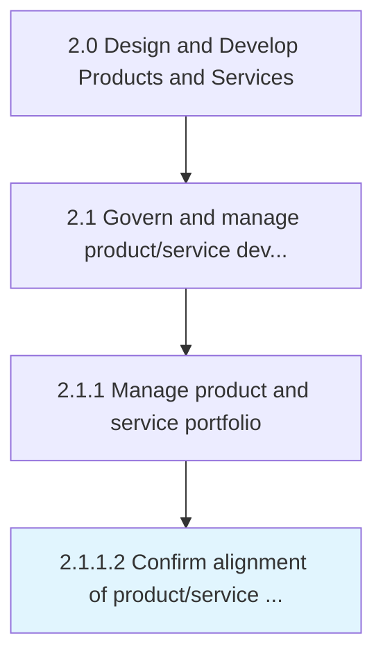
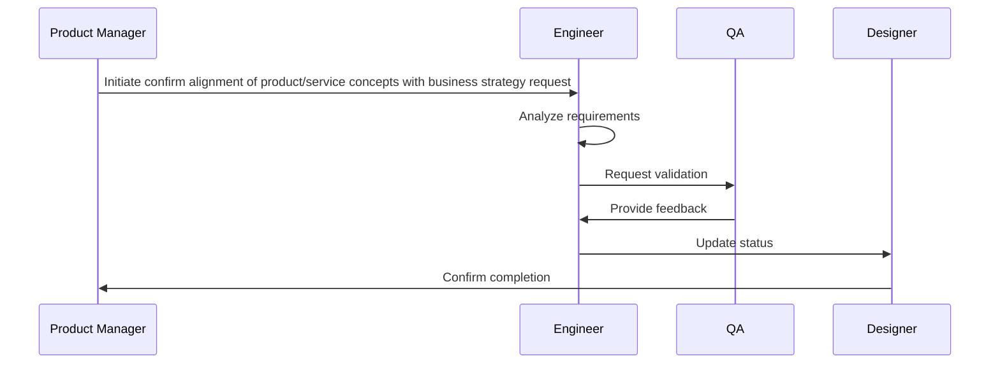

# Confirm alignment of product/service concepts with business strategy

> Checking the alignment of product/service portfolio, and its individual offerings, with the organization's overall strategy and planning for the development of new or revised solutions.

## Overview

Activity 2.1.1.2 is an activity within the Design and Develop Products and Services framework. 

Checking the alignment of product/service portfolio, and its individual offerings, with the organization's overall strategy and planning for the development of new or revised solutions. Conduct reality checks on new product/service concepts prior to committing significant investment to ensure that the revamped solutions' portfolio is in line with the overall business strategy, aligns organizational processes for their development, and creates a plan for assimilating these changes in the organization's offerings. Enlist senior management executives.

## Process Hierarchy



## Key Statistics

| Metric | Value |
|--------|-------|
| APQC Code | 10066 |
| Hierarchy ID | 2.1.1.2 |
| Level | Activity |
| Parent | [2.1.1](../) |
| Sub-Processes | 0 |


## Process Overview

Product development processes design, develop, and introduce new products and services to meet customer needs. This process focuses on confirm alignment of product/service concepts with business strategy, which is essential for organizational effectiveness and achieving business objectives.

## Key Metrics

| Metric | Description | Target |
|--------|-------------|--------|
| Time to market | Measure of time to market | Target varies by organization |
| Product success rate | Measure of product success rate | Target varies by organization |
| R&D ROI | Measure of r&d roi | Target varies by organization |
| Patent filings | Measure of patent filings | Target varies by organization |

## Related Departments

- [Product](/departments/Product)
- [Research](/departments/Research)
- [Quality](/departments/Quality)

## Related Occupations

- [Product Managers](/occupations/Management/ProductManagers)
- [Industrial Engineers](/occupations/Engineering/IndustrialEngineers)
- [Quality Control Managers](/occupations/Management/QualityControlManagers)

## RACI Matrix

| Activity | Responsible | Accountable | Consulted | Informed |
|----------|-------------|-------------|-----------|----------|
| Plan | Process Owner | Manager | Stakeholders | Team |
| Execute | Team | Process Owner | Manager | Stakeholders |
| Monitor | Analyst | Manager | Process Owner | Leadership |
| Improve | Process Owner | Manager | Team | Stakeholders |

## GraphDL Semantic Structure

```graphdl
confirm.Alignment.of.ProductserviceConceptsWithBusinessStrategy
```

| Component | Value | Description |
|-----------|-------|-------------|
| Verb | `confirm` | Primary action |
| Object | `alignment` | Direct object |
| Preposition | `of` | Relationship |
| PrepObject | `product/service concepts with business strategy` | Indirect object |


## Process Sequence


## Related Concepts

- Alignment
- ProductConceptsWithBusinessStrategy
- Alignment
- ServiceConceptsWithBusinessStrategy


---

*Source: APQC PCF 10066 (2.1.1.2) - APQC*
