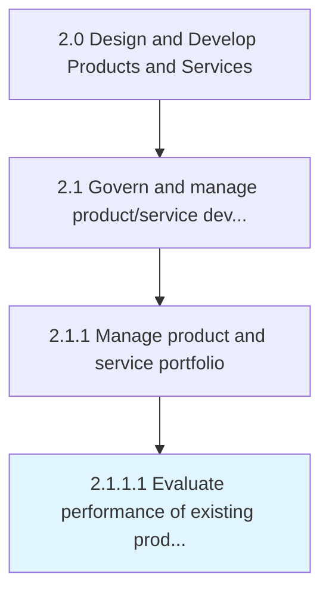
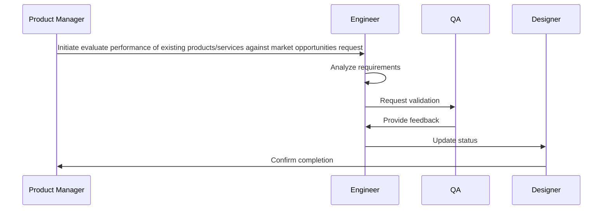

# Evaluate performance of existing products/services against market opportunities

> Assessing the capabilities and performance of existing products/services, in light of market opportunities.

## Overview

Activity 2.1.1.1 is an activity within the Design and Develop Products and Services framework. 

Assessing the capabilities and performance of existing products/services, in light of market opportunities. Examine performance of the existing line of products/services, including measures of profitability, penetration, and value delivered. Identify gaps between existing solutions' portfolio or their performance levels, on the one hand, and the current market demand, available technologies, and/or customer expectations, on the other. Consider opportunities in the present market environment and any relation with the performance. Consider input from professional services providers.

## Process Hierarchy



## Key Statistics

| Metric | Value |
|--------|-------|
| APQC Code | 10063 |
| Hierarchy ID | 2.1.1.1 |
| Level | Activity |
| Parent | [2.1.1](../) |
| Sub-Processes | 0 |


## Process Overview

Product development processes design, develop, and introduce new products and services to meet customer needs. This process focuses on evaluate performance of existing products/services against market opportunities, which is essential for organizational effectiveness and achieving business objectives.

## Key Metrics

| Metric | Description | Target |
|--------|-------------|--------|
| Time to market | Measure of time to market | Target varies by organization |
| Product success rate | Measure of product success rate | Target varies by organization |
| R&D ROI | Measure of r&d roi | Target varies by organization |
| Patent filings | Measure of patent filings | Target varies by organization |

## Related Departments

- [Product](/departments/Product)
- [Research](/departments/Research)
- [Quality](/departments/Quality)

## Related Occupations

- [Product Managers](/occupations/Management/ProductManagers)
- [Industrial Engineers](/occupations/Engineering/IndustrialEngineers)
- [Quality Control Managers](/occupations/Management/QualityControlManagers)

## RACI Matrix

| Activity | Responsible | Accountable | Consulted | Informed |
|----------|-------------|-------------|-----------|----------|
| Plan | Process Owner | Manager | Stakeholders | Team |
| Execute | Team | Process Owner | Manager | Stakeholders |
| Monitor | Analyst | Manager | Process Owner | Leadership |
| Improve | Process Owner | Manager | Team | Stakeholders |

## GraphDL Semantic Structure

```graphdl
evaluate.Performance.of.ExistingProductsservicesAgainstMarketOpportunities
```

| Component | Value | Description |
|-----------|-------|-------------|
| Verb | `evaluate` | Primary action |
| Object | `performance` | Direct object |
| Preposition | `of` | Relationship |
| PrepObject | `existing products/services against market opportunities` | Indirect object |


## Process Sequence


## Related Concepts

- Performance
- ExistingProductsAgainstMarketOpportunities
- Performance
- ExistingServicesAgainstMarketOpportunities


---

*Source: APQC PCF 10063 (2.1.1.1) - APQC*
