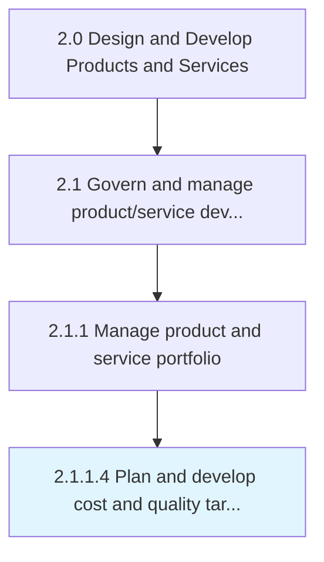
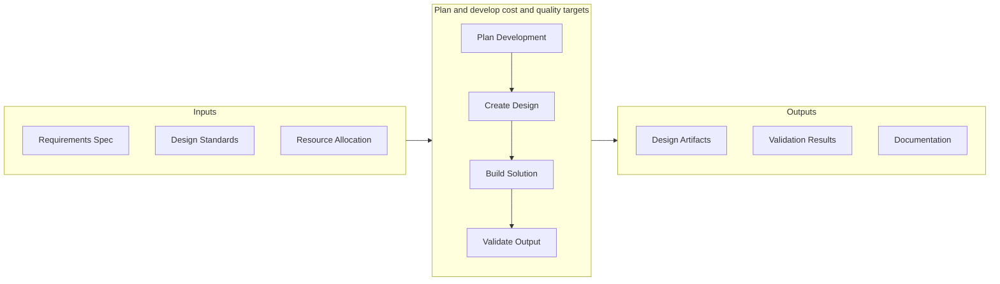
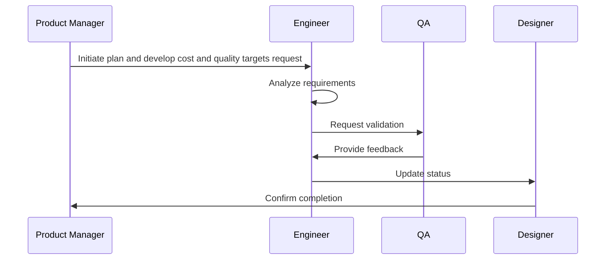

# Plan and develop cost and quality targets

> Setting prerequisites for the cost of development and quality standards for the new solutions' portfolio and/or its individual offerings.

## Overview

Activity 2.1.1.4 is an activity within the Design and Develop Products and Services framework. 

Setting prerequisites for the cost of development and quality standards for the new solutions' portfolio and/or its individual offerings. Set targets for the budget and quality standards for the revamped portfolio of solution offerings. Prepare a plan for the outlay required for revising and adding new product/services. Identify intended levels of quality for these, bearing in mind the existing standards of solutions offered by the organization and its competitors. Enlist senior management executives, particularly those responsible for finance and budgeting, product/service design, manufacturing/processing, delivery, and quality control.

This activity is critical to ensuring that products and services meet established quality benchmarks before advancing through subsequent development stages. It involves systematic evaluation against predefined criteria, cross-functional collaboration to address identified gaps, and documentation of findings to support continuous improvement. The process draws on both quantitative metrics and qualitative assessments from subject matter experts.

## Process Hierarchy



## Key Statistics

| Metric | Value |
|--------|-------|
| APQC Code | 10073 |
| Hierarchy ID | 2.1.1.4 |
| Level | Activity |
| Parent | [2.1.1](../) |
| Sub-Processes | 0 |


## GraphDL Semantic Structure

```graphdl
plan.AndDevelopCostAndQualityTargets
```

| Component | Value | Description |
|-----------|-------|-------------|
| Verb | `plan` | Primary action |
| Object | `and develop cost and quality targets` | Direct object |


## Related Concepts

- CostTargets
- QualityTargets
- CostTargets
- QualityTargets


## Process Flow




## Process Sequence


## RACI Matrix

| Activity | Responsible | Accountable | Consulted | Informed |
|----------|-------------|-------------|-----------|----------|
| Define scope and objectives | Product Manager | VP of Product | Engineering Lead | Executive Team |
| Execute and document | Product Analyst | Product Manager | Quality Assurance | Stakeholders |
| Review and approve | Quality Manager | VP of Product | Legal/Compliance | Product Team |

## Related Occupations

- [Product Manager](/occupations/Management/ProductManagers) - Leads portfolio governance and lifecycle management
- [Chief Technology Officer](/occupations/Management/ChiefExecutives) - Provides strategic oversight for product development
- [Quality Assurance Manager](/occupations/Management/QualityControlSystems) - Ensures compliance with quality standards
- [Regulatory Affairs Specialist](/occupations/Legal/RegulatoryAffairs) - Manages patent, copyright, and regulatory compliance

## Related Departments

- Product Management - Owns product portfolio strategy and governance
- Quality Assurance - Maintains quality standards and compliance
- [Legal & Compliance](/departments/Legal) - Manages intellectual property and regulatory requirements

## Industry Variations

### Manufacturing

Cost targets are tightly linked to bill of materials optimization, production line efficiency, and supply chain cost negotiations.

### Life Sciences

Cost planning must account for lengthy R&D cycles, clinical trial expenses, and post-market surveillance investments.

### Retail

Cost and quality targets are driven by competitive pricing pressures, seasonal inventory management, and private label margin requirements.

## KPIs & Metrics

| Metric | Description | Target |
|--------|-------------|--------|
| Defect Rate | Percentage of defects identified per review cycle | < 2% |
| Review Cycle Time | Average time to complete review process | < 5 business days |
| First Pass Yield | Percentage of items passing review on first attempt | > 85% |

---

*Source: APQC PCF 10073 (2.1.1.4) - APQC*
