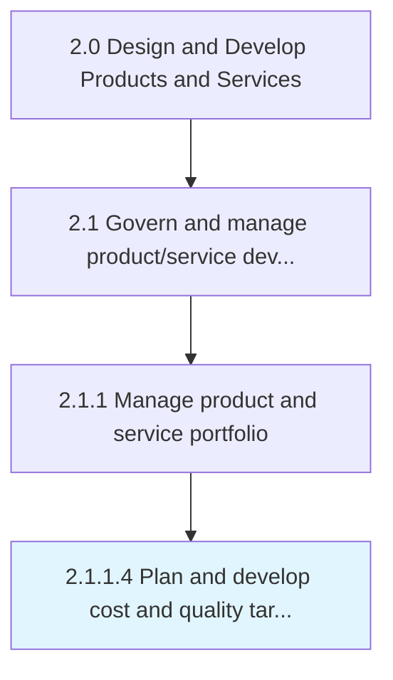

# Plan and develop cost and quality targets

> Setting prerequisites for the cost of development and quality standards for the new solutions' portfolio and/or its individual offerings.

## Overview

Activity 2.1.1.4 is an activity within the Design and Develop Products and Services framework. 

Setting prerequisites for the cost of development and quality standards for the new solutions' portfolio and/or its individual offerings. Set targets for the budget and quality standards for the revamped portfolio of solution offerings. Prepare a plan for the outlay required for revising and adding new product/services. Identify intended levels of quality for these, bearing in mind the existing standards of solutions offered by the organization and its competitors. Enlist senior management executives, particularly those responsible for finance and budgeting, product/service design, manufacturing/processing, delivery, and quality control.

## Process Hierarchy



## Key Statistics

| Metric | Value |
|--------|-------|
| APQC Code | 10073 |
| Hierarchy ID | 2.1.1.4 |
| Level | Activity |
| Parent | [2.1.1](../) |
| Sub-Processes | 0 |


## GraphDL Semantic Structure

```
plan.AndDevelopCostAndQualityTargets
```

| Component | Value | Description |
|-----------|-------|-------------|
| Verb | `plan` | Primary action |
| Object | `and develop cost and quality targets` | Direct object |


## Related Concepts

- [CostTargets](/concepts/CostTargets)
- [QualityTargets](/concepts/QualityTargets)
- [CostTargets](/concepts/CostTargets)
- [QualityTargets](/concepts/QualityTargets)


---

*Source: APQC PCF 10073 (2.1.1.4) - APQC*
