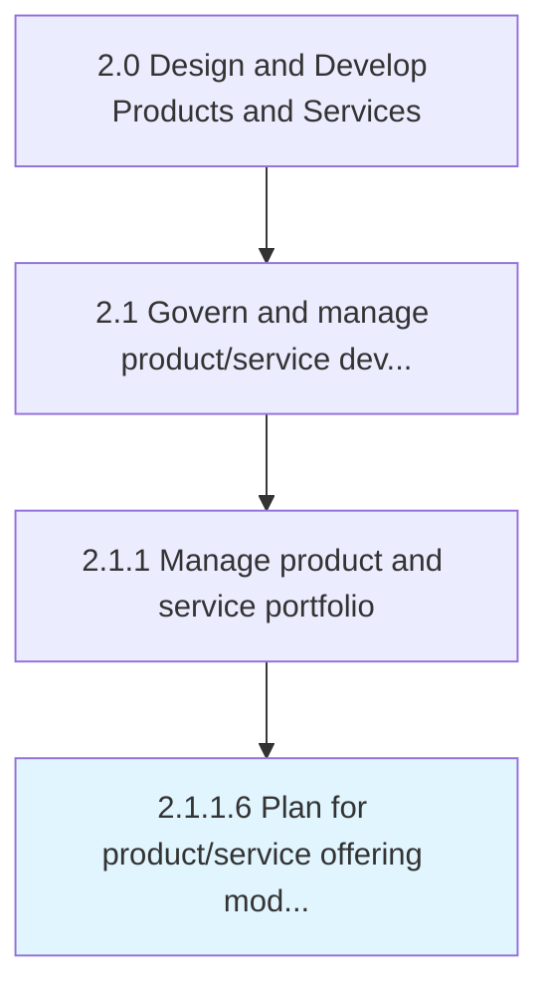

# Plan for product/service offering modifications

> Developing a programmatic procedure for changing products/services while paying heed to all stakeholders involved and the prerequisites identified.

## Overview

Activity 2.1.1.6 is an activity within the Design and Develop Products and Services framework. 

Developing a programmatic procedure for changing products/services while paying heed to all stakeholders involved and the prerequisites identified. Create a plan for changing the existing portfolio of solution offerings. Develop a systematic program for the design, processing, and delivery of the new product/service concepts. Construct project-flow diagrams. Identify the stakeholders involved and personnel responsible for each stage, as well as the necessary decisions. Earmark the budgetary outlay, and conduct any strategic planning required.

## Process Hierarchy



## Key Statistics

| Metric | Value |
|--------|-------|
| APQC Code | 10076 |
| Hierarchy ID | 2.1.1.6 |
| Level | Activity |
| Parent | [2.1.1](../) |
| Sub-Processes | 0 |


## GraphDL Semantic Structure

```
plan.ForProductserviceOfferingModifications
```

| Component | Value | Description |
|-----------|-------|-------------|
| Verb | `plan` | Primary action |
| Object | `for product/service offering modifications` | Direct object |


## Related Concepts

- [ProductOfferingModifications](/concepts/ProductOfferingModifications)
- [ServiceOfferingModifications](/concepts/ServiceOfferingModifications)


---

*Source: APQC PCF 10076 (2.1.1.6) - APQC*
