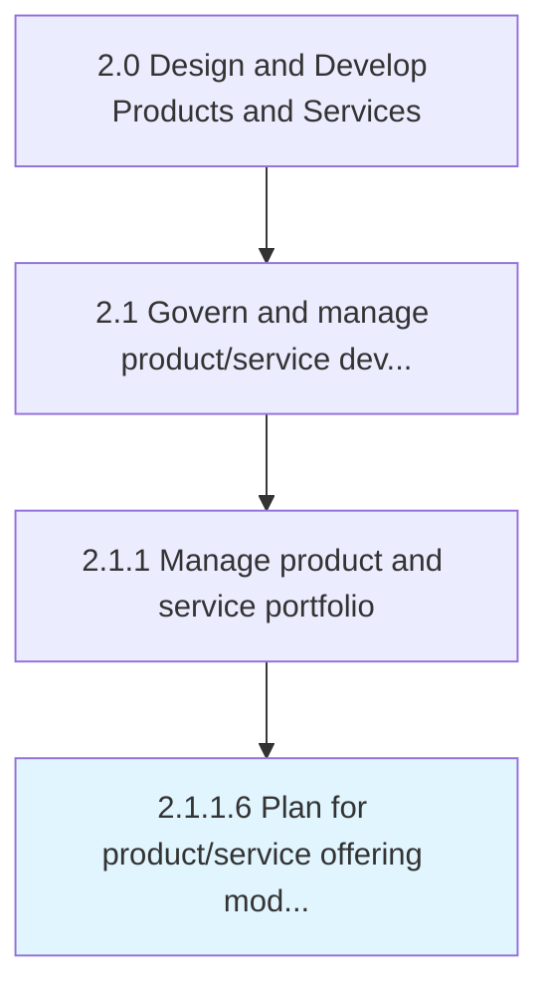
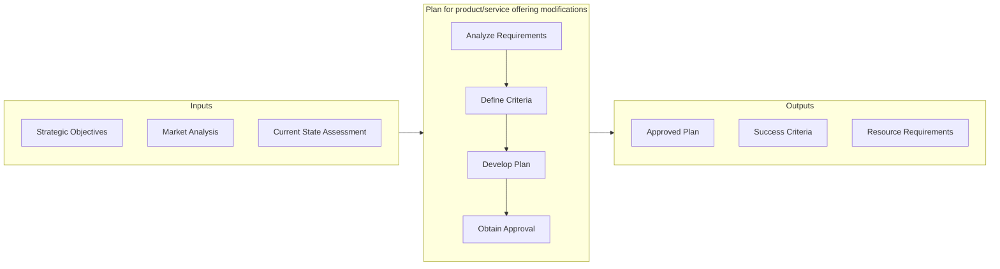

# Plan for product/service offering modifications

> Developing a programmatic procedure for changing products/services while paying heed to all stakeholders involved and the prerequisites identified.

## Overview

Activity 2.1.1.6 is an activity within the Design and Develop Products and Services framework. 

Developing a programmatic procedure for changing products/services while paying heed to all stakeholders involved and the prerequisites identified. Create a plan for changing the existing portfolio of solution offerings. Develop a systematic program for the design, processing, and delivery of the new product/service concepts. Construct project-flow diagrams. Identify the stakeholders involved and personnel responsible for each stage, as well as the necessary decisions. Earmark the budgetary outlay, and conduct any strategic planning required.

This activity provides strategic direction by establishing clear objectives, criteria, and timelines that guide subsequent execution activities. It requires input from multiple stakeholders to ensure alignment with organizational goals and resource constraints. The resulting plans and specifications serve as the authoritative reference for all downstream activities.

## Process Hierarchy



## Key Statistics

| Metric | Value |
|--------|-------|
| APQC Code | 10076 |
| Hierarchy ID | 2.1.1.6 |
| Level | Activity |
| Parent | [2.1.1](../) |
| Sub-Processes | 0 |


## GraphDL Semantic Structure

```
plan.ForProductserviceOfferingModifications
```

| Component | Value | Description |
|-----------|-------|-------------|
| Verb | `plan` | Primary action |
| Object | `for product/service offering modifications` | Direct object |


## Related Concepts

- ProductOfferingModifications
- ServiceOfferingModifications


## Process Flow



## RACI Matrix

| Activity | Responsible | Accountable | Consulted | Informed |
|----------|-------------|-------------|-----------|----------|
| Define scope and objectives | Product Manager | VP of Product | Engineering Lead | Executive Team |
| Execute and document | Product Analyst | Product Manager | Quality Assurance | Stakeholders |
| Review and approve | Quality Manager | VP of Product | Legal/Compliance | Product Team |

## Related Occupations

- [Product Manager](/occupations/Management/ProductManagers) - Leads portfolio governance and lifecycle management
- [Chief Technology Officer](/occupations/Management/ChiefExecutives) - Provides strategic oversight for product development
- [Quality Assurance Manager](/occupations/Management/QualityControlSystems) - Ensures compliance with quality standards
- [Regulatory Affairs Specialist](/occupations/Legal/RegulatoryAffairs) - Manages patent, copyright, and regulatory compliance

## Related Departments

- [Product Management](/departments/ProductManagement) - Owns product portfolio strategy and governance
- [Quality Assurance](/departments/QualityAssurance) - Maintains quality standards and compliance
- [Legal & Compliance](/departments/Legal) - Manages intellectual property and regulatory requirements

## Industry Variations

### Manufacturing

Emphasizes physical product specifications, tooling requirements, and lean production principles in process execution.

### Technology

Focuses on agile development methodologies, continuous integration, and rapid iteration cycles with digital-first delivery.

### Healthcare

Requires adherence to patient safety standards, clinical efficacy validation, and comprehensive regulatory documentation.

## KPIs & Metrics

| Metric | Description | Target |
|--------|-------------|--------|
| Process Cycle Time | Average duration to complete this activity | < 10 business days |
| Completion Rate | Percentage of activities completed on schedule | > 90% |
| Stakeholder Satisfaction | Internal satisfaction score for process outputs | > 4.0/5.0 |

---

*Source: APQC PCF 10076 (2.1.1.6) - APQC*
