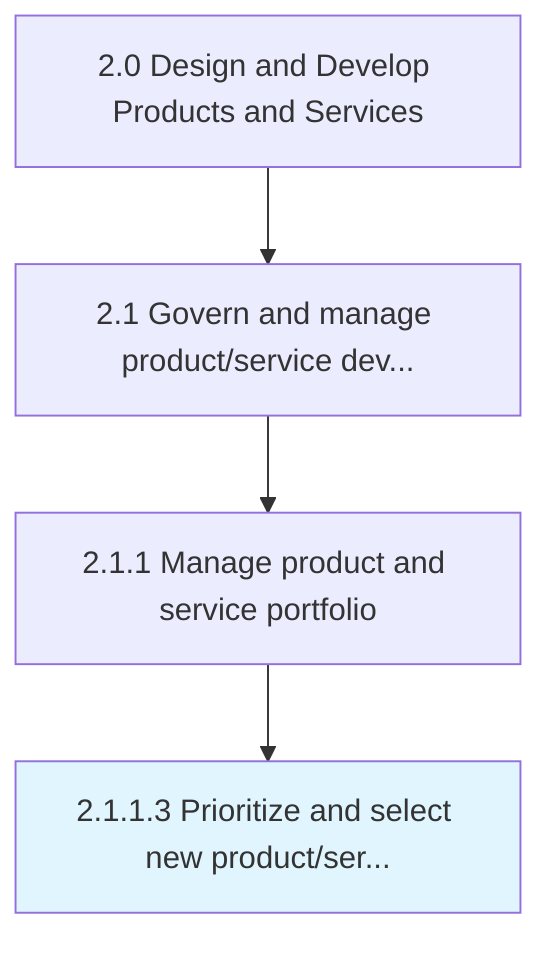

# Prioritize and select new product/service concepts

> Selecting from among the potential new/revised solutions and capitalizing on market opportunities so that they meet the cost and quality prerequisites.

## Overview

Activity 2.1.1.3 is an activity within the Design and Develop Products and Services framework. 

Selecting from among the potential new/revised solutions and capitalizing on market opportunities so that they meet the cost and quality prerequisites. Create an index of product/service concepts, and arrange them in order of preference. Base prioritization on adherence to Plan and develop cost and quality targets [10073], and choose options that would comprise the revised solution portfolio.

## Process Hierarchy



## Key Statistics

| Metric | Value |
|--------|-------|
| APQC Code | 10074 |
| Hierarchy ID | 2.1.1.3 |
| Level | Activity |
| Parent | [2.1.1](../) |
| Sub-Processes | 0 |


## GraphDL Semantic Structure

```
prioritize.AndSelectNewProductserviceConcepts
```

| Component | Value | Description |
|-----------|-------|-------------|
| Verb | `prioritize` | Primary action |
| Object | `and select new product/service concepts` | Direct object |


## Related Concepts

- NewProductConcepts
- NewServiceConcepts
- NewProductConcepts
- NewServiceConcepts


---

*Source: APQC PCF 10074 (2.1.1.3) - APQC*
