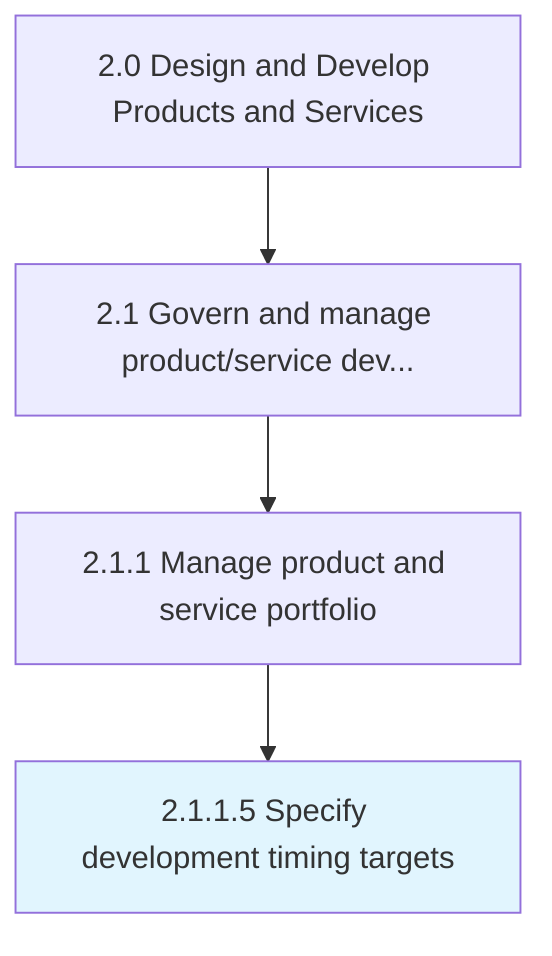

# Specify development timing targets

> Determining the individual and collective timeframe for realizing new/revised solutions.

## Overview

Activity 2.1.1.5 is an activity within the Design and Develop Products and Services framework. 

Determining the individual and collective timeframe for realizing new/revised solutions. Create a schedule that clearly demarcates the timeframes designated for the development of every new solution and/or revising each of the existing ones. Create a timetable by setting deadlines for each step in overhauling the product/service portfolio.

## Process Hierarchy



## Key Statistics

| Metric | Value |
|--------|-------|
| APQC Code | 10075 |
| Hierarchy ID | 2.1.1.5 |
| Level | Activity |
| Parent | [2.1.1](../) |
| Sub-Processes | 0 |


## GraphDL Semantic Structure

```
specify.DevelopmentTimingTargets
```

| Component | Value | Description |
|-----------|-------|-------------|
| Verb | `specify` | Primary action |
| Object | `development timing targets` | Direct object |


## Related Concepts

- DevelopmentTimingTargets


---

*Source: APQC PCF 10075 (2.1.1.5) - APQC*
