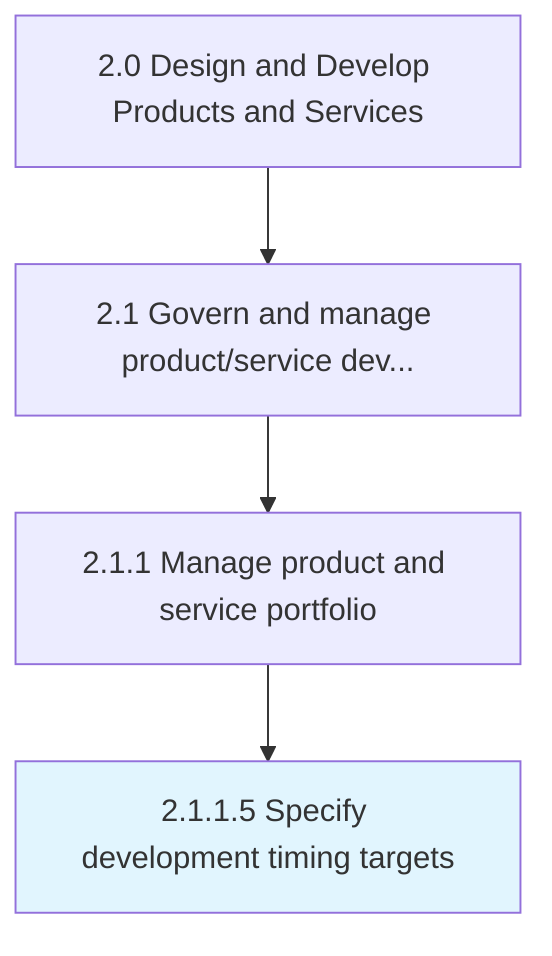
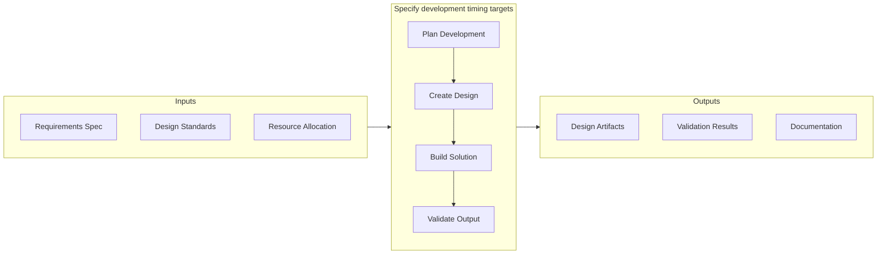
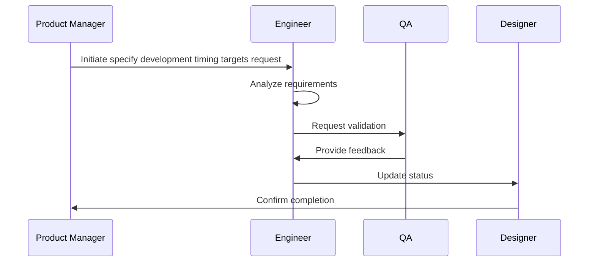

# Specify development timing targets

> Determining the individual and collective timeframe for realizing new/revised solutions.

## Overview

Activity 2.1.1.5 is an activity within the Design and Develop Products and Services framework. 

Determining the individual and collective timeframe for realizing new/revised solutions. Create a schedule that clearly demarcates the timeframes designated for the development of every new solution and/or revising each of the existing ones. Create a timetable by setting deadlines for each step in overhauling the product/service portfolio.

This activity provides strategic direction by establishing clear objectives, criteria, and timelines that guide subsequent execution activities. It requires input from multiple stakeholders to ensure alignment with organizational goals and resource constraints. The resulting plans and specifications serve as the authoritative reference for all downstream activities.

## Process Hierarchy



## Key Statistics

| Metric | Value |
|--------|-------|
| APQC Code | 10075 |
| Hierarchy ID | 2.1.1.5 |
| Level | Activity |
| Parent | [2.1.1](../) |
| Sub-Processes | 0 |


## GraphDL Semantic Structure

```graphdl
specify.DevelopmentTimingTargets
```

| Component | Value | Description |
|-----------|-------|-------------|
| Verb | `specify` | Primary action |
| Object | `development timing targets` | Direct object |


## Related Concepts

- DevelopmentTimingTargets


## Process Flow




## Process Sequence


## RACI Matrix

| Activity | Responsible | Accountable | Consulted | Informed |
|----------|-------------|-------------|-----------|----------|
| Define scope and objectives | Product Manager | VP of Product | Engineering Lead | Executive Team |
| Execute and document | Product Analyst | Product Manager | Quality Assurance | Stakeholders |
| Review and approve | Quality Manager | VP of Product | Legal/Compliance | Product Team |

## Related Occupations

- [Product Manager](/occupations/Management/ProductManagers) - Leads portfolio governance and lifecycle management
- [Chief Technology Officer](/occupations/Management/ChiefExecutives) - Provides strategic oversight for product development
- [Quality Assurance Manager](/occupations/Management/QualityControlSystems) - Ensures compliance with quality standards
- [Regulatory Affairs Specialist](/occupations/Legal/RegulatoryAffairs) - Manages patent, copyright, and regulatory compliance

## Related Departments

- Product Management - Owns product portfolio strategy and governance
- Quality Assurance - Maintains quality standards and compliance
- [Legal & Compliance](/departments/Legal) - Manages intellectual property and regulatory requirements

## Industry Variations

### Manufacturing

Emphasizes physical product specifications, tooling requirements, and lean production principles in process execution.

### Technology

Focuses on agile development methodologies, continuous integration, and rapid iteration cycles with digital-first delivery.

### Healthcare

Requires adherence to patient safety standards, clinical efficacy validation, and comprehensive regulatory documentation.

## KPIs & Metrics

| Metric | Description | Target |
|--------|-------------|--------|
| Time to Prototype | Duration from concept approval to working prototype | < 30 days |
| Design Iteration Count | Number of design revisions before approval | < 3 iterations |
| Specification Compliance | Percentage of design specs met by prototype | > 95% |

---

*Source: APQC PCF 10075 (2.1.1.5) - APQC*
