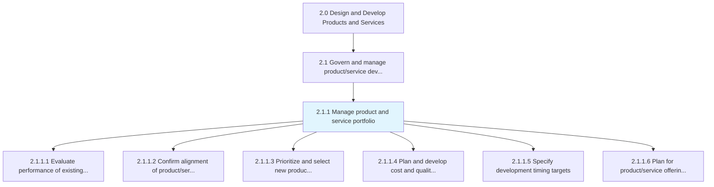
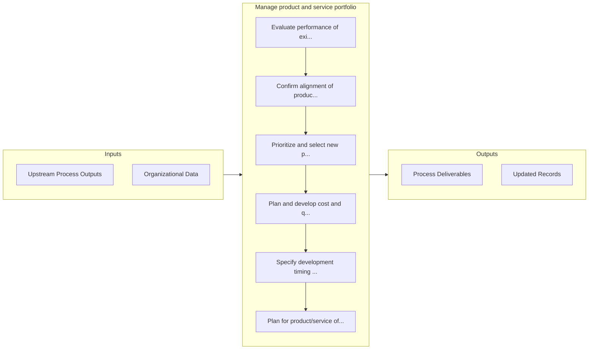

# Manage product and service portfolio

> Managing a portfolio of product/service offerings to take advantage of shifts in the market expectations, all the while coordinating with the overall business strategy.

## Overview

Process 2.1.1 is a core process that defines the specific procedures for manage product and service portfolio. 

Managing a portfolio of product/service offerings to take advantage of shifts in the market expectations, all the while coordinating with the overall business strategy. Revisit the product/service portfolio in light of market opportunities, and overhaul it to capture value created by these opportunities. Identify gaps between current offerings and the market expectations to direct the organization's R&D activity. Create new solutions, and revise or retire existing ones so that the revamped portfolio aligns with Develop a business strategy [10015].

## Process Hierarchy



## Key Statistics

| Metric | Value |
|--------|-------|
| APQC Code | 10061 |
| Hierarchy ID | 2.1.1 |
| Level | Process |
| Parent | [2.1](../) |
| Sub-Processes | 6 |


## GraphDL Semantic Structure

```graphdl
manage.ProductAndServicePortfolio
```

| Component | Value | Description |
|-----------|-------|-------------|
| Verb | `manage` | Primary action |
| Object | `product and service portfolio` | Direct object |


## Process Flow



## Sub-Processes

| Process | Hierarchy ID | Description |
|---------|-------------|-------------|
| [Evaluate performance of existing products/services against market opportunities](./EvaluatePerformanceOfExistingProductsservicesAgainstMarketOpportunities) | 2.1.1.1 | Assessing the capabilities and performance of existing products/services, in light of market opportu |
| [Confirm alignment of product/service concepts with business strategy](./ConfirmAlignmentOfProductserviceConceptsWithBusinessStrategy) | 2.1.1.2 | Checking the alignment of product/service portfolio, and its individual offerings, with the organiza |
| [Prioritize and select new product/service concepts](./PrioritizeAndSelectNewProductserviceConcepts) | 2.1.1.3 | Selecting from among the potential new/revised solutions and capitalizing on market opportunities so |
| [Plan and develop cost and quality targets](./PlanAndDevelopCostAndQualityTargets) | 2.1.1.4 | Setting prerequisites for the cost of development and quality standards for the new solutions' portf |
| [Specify development timing targets](./SpecifyDevelopmentTimingTargets) | 2.1.1.5 | Determining the individual and collective timeframe for realizing new/revised solutions |
| [Plan for product/service offering modifications](./PlanForProductserviceOfferingModifications) | 2.1.1.6 | Developing a programmatic procedure for changing products/services while paying heed to all stakehol |


## Related Concepts

- Product
- ServicePortfolio


---

*Source: APQC PCF 10061 (2.1.1) - APQC*
