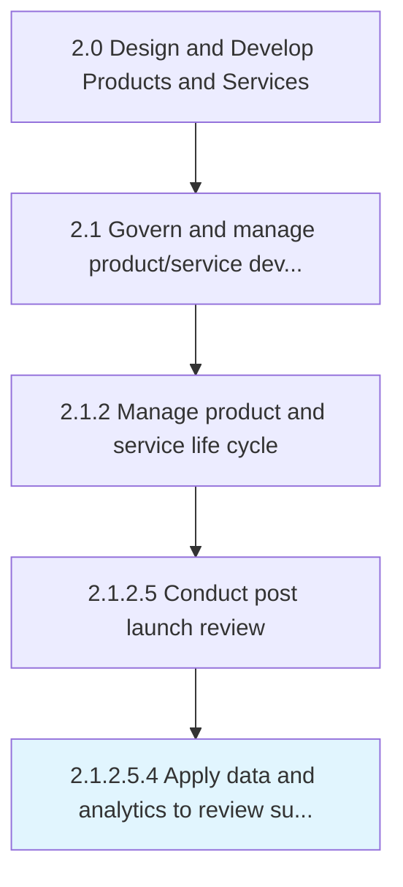
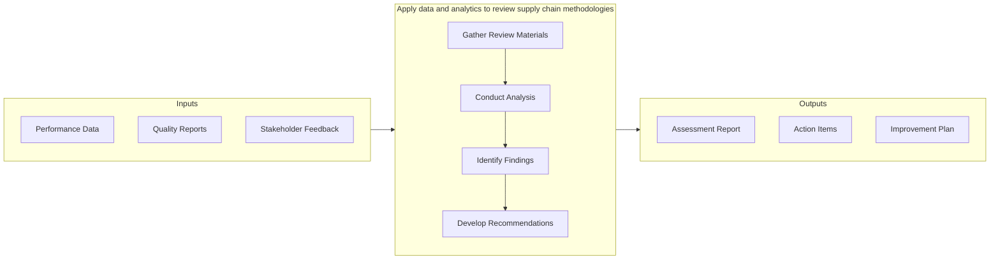

# Apply data and analytics to review supply chain methodologies

> Collecting and examining raw data with the purpose of drawing conclusions about that information and correlate gaps and efficiencies to the existing supply chain channels.

## Overview

Sub-Activity 2.1.2.5.4 is an activity within the Design and Develop Products and Services framework. 

Collecting and examining raw data with the purpose of drawing conclusions about that information and correlate gaps and efficiencies to the existing supply chain channels. Apply the information to make better business decisions to the related supply chain methodologies to meet efficiency.

This activity contributes to the organization's product development objectives by executing defined processes within established quality and timeline parameters. It requires coordination across relevant functional teams and adherence to organizational standards. Outputs from this activity feed into downstream processes and contribute to overall product development success.

## Process Hierarchy



## Key Statistics

| Metric | Value |
|--------|-------|
| APQC Code | 19647 |
| Hierarchy ID | 2.1.2.5.4 |
| Level | Sub-Activity |
| Parent | [2.1.2.5](../) |
| Sub-Processes | 0 |


## GraphDL Semantic Structure

```
apply.DataAndAnalytics.to.ReviewSupplyChainMethodologies
```

| Component | Value | Description |
|-----------|-------|-------------|
| Verb | `apply` | Primary action |
| Object | `data and analytics` | Direct object |
| Preposition | `to` | Relationship |
| PrepObject | `review supply chain methodologies` | Indirect object |


## Related Concepts

- Data
- ReviewSupplyChainMethodologies
- Analytics
- ReviewSupplyChainMethodologies


## Process Flow



## RACI Matrix

| Activity | Responsible | Accountable | Consulted | Informed |
|----------|-------------|-------------|-----------|----------|
| Define scope and objectives | Product Manager | VP of Product | Engineering Lead | Executive Team |
| Execute and document | Product Analyst | Product Manager | Quality Assurance | Stakeholders |
| Review and approve | Quality Manager | VP of Product | Legal/Compliance | Product Team |

## Related Occupations

- [Product Manager](/occupations/Management/ProductManagers) - Leads portfolio governance and lifecycle management
- [Chief Technology Officer](/occupations/Management/ChiefExecutives) - Provides strategic oversight for product development
- [Quality Assurance Manager](/occupations/Management/QualityControlSystems) - Ensures compliance with quality standards
- [Regulatory Affairs Specialist](/occupations/Legal/RegulatoryAffairs) - Manages patent, copyright, and regulatory compliance

## Related Departments

- [Product Management](/departments/ProductManagement) - Owns product portfolio strategy and governance
- [Quality Assurance](/departments/QualityAssurance) - Maintains quality standards and compliance
- [Legal & Compliance](/departments/Legal) - Manages intellectual property and regulatory requirements

## Industry Variations

### Manufacturing

Emphasizes physical product specifications, tooling requirements, and lean production principles in process execution.

### Technology

Focuses on agile development methodologies, continuous integration, and rapid iteration cycles with digital-first delivery.

### Healthcare

Requires adherence to patient safety standards, clinical efficacy validation, and comprehensive regulatory documentation.

## KPIs & Metrics

| Metric | Description | Target |
|--------|-------------|--------|
| Defect Rate | Percentage of defects identified per review cycle | < 2% |
| Review Cycle Time | Average time to complete review process | < 5 business days |
| First Pass Yield | Percentage of items passing review on first attempt | > 85% |

---

*Source: APQC PCF 19647 (2.1.2.5.4) - APQC*
