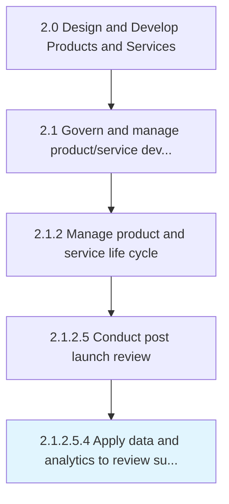

# Apply data and analytics to review supply chain methodologies

> Collecting and examining raw data with the purpose of drawing conclusions about that information and correlate gaps and efficiencies to the existing supply chain channels.

## Overview

Sub-Activity 2.1.2.5.4 is an activity within the Design and Develop Products and Services framework. 

Collecting and examining raw data with the purpose of drawing conclusions about that information and correlate gaps and efficiencies to the existing supply chain channels. Apply the information to make better business decisions to the related supply chain methodologies to meet efficiency.

## Process Hierarchy



## Key Statistics

| Metric | Value |
|--------|-------|
| APQC Code | 19647 |
| Hierarchy ID | 2.1.2.5.4 |
| Level | Sub-Activity |
| Parent | [2.1.2.5](../) |
| Sub-Processes | 0 |


## GraphDL Semantic Structure

```
apply.DataAndAnalytics.to.ReviewSupplyChainMethodologies
```

| Component | Value | Description |
|-----------|-------|-------------|
| Verb | `apply` | Primary action |
| Object | `data and analytics` | Direct object |
| Preposition | `to` | Relationship |
| PrepObject | `review supply chain methodologies` | Indirect object |


## Related Concepts

- Data
- ReviewSupplyChainMethodologies
- Analytics
- ReviewSupplyChainMethodologies


---

*Source: APQC PCF 19647 (2.1.2.5.4) - APQC*
